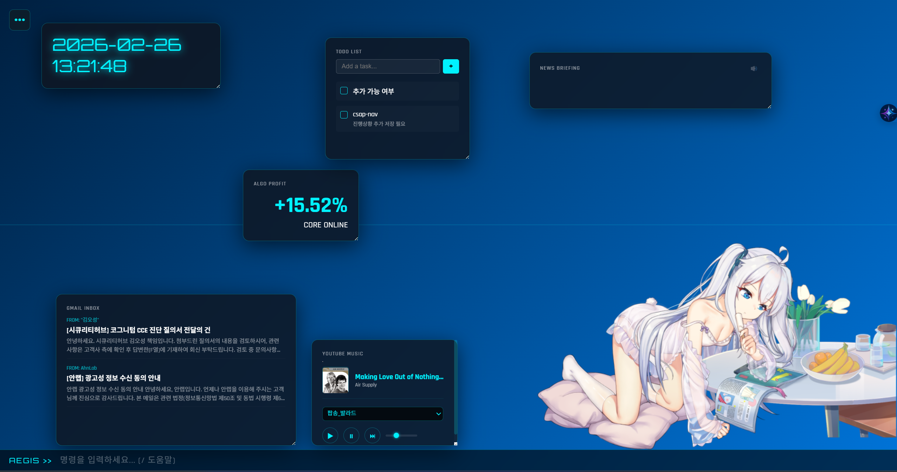
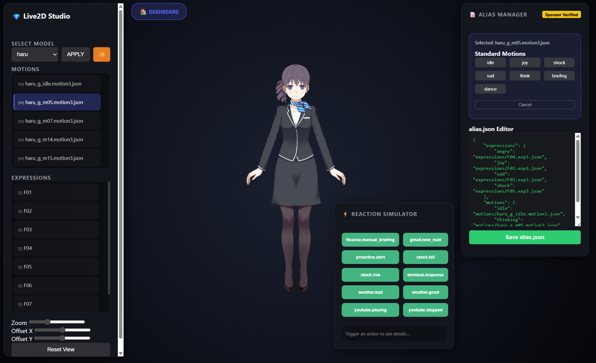
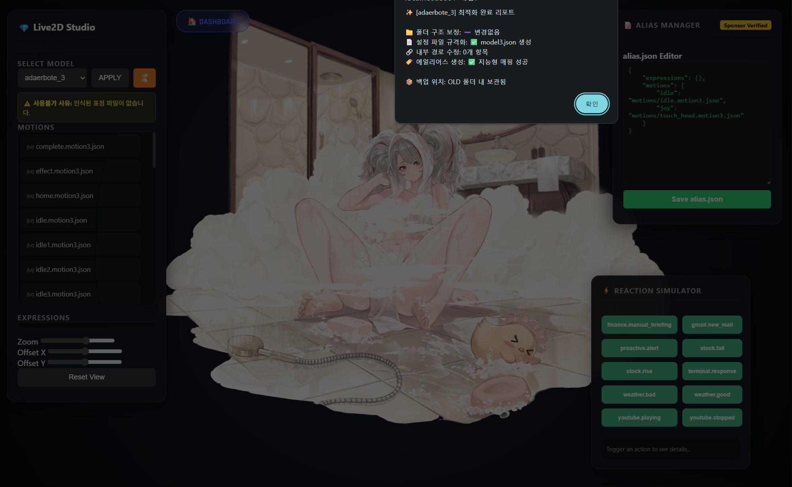
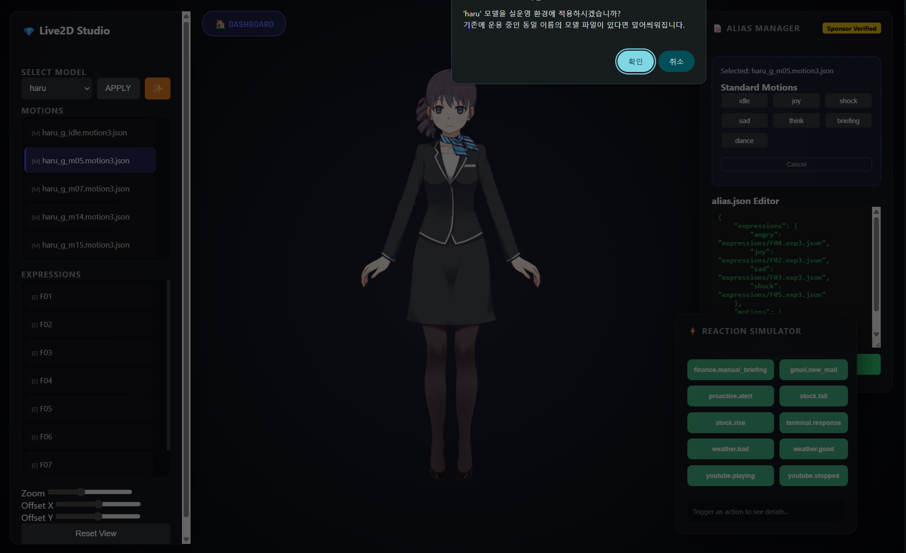
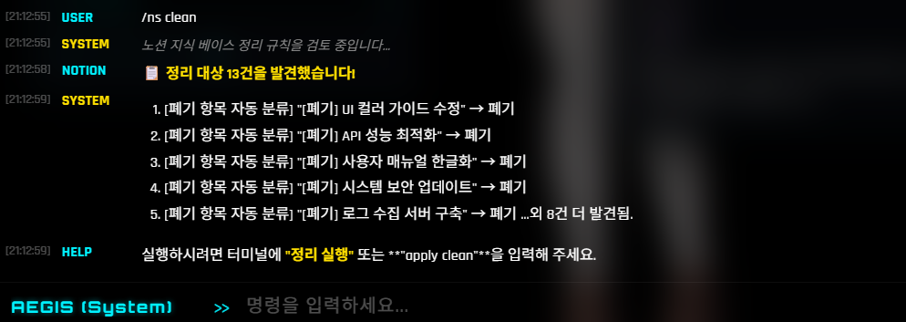
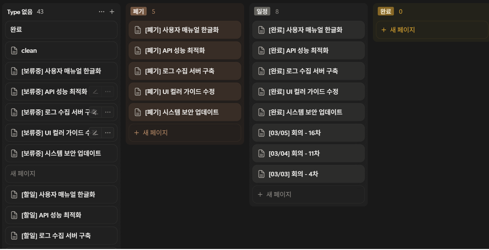

# AEGIS Intelligence Dashboard

AEGIS(에이지스)는 AI(Gemini) 모델과 Edge-TTS를 결합하여 만든 실시간 지능형 개인 비서 대시보드입니다.  
사용자의 하루 일정, 주식/금융 시장 데이터, 실시간 날씨, 최신 뉴스 헤드라인, 미확인 이메일 등을 수집하여 브리핑하고, 실시간 반응형 2D 아바타(Live2D)를 통해 시각적·음성적 상호작용을 제공합니다.


## ✨ 주요 기능
- **통합 대시보드**: 날씨, 뉴스, 구글 일정, 투두리스트, 금융 지수 및 관심 주식 종목, 시스템 리소스 등 한눈에 확인.
- **AI 스마트 브리핑**: 현재 수집된 모든 데이터를 바탕으로 AI(Gemini)가 상황에 맞는 아침/저녁 브리핑을 음성으로 진행.
- **반응형 아바타 (Live2D)**: 상황과 정보(예: 주가 급등/급락)에 따라 모션과 표정이 달라지는 쌍방향 인터랙션.
- **백그라운드 BGM 모듈**: YouTube Music API를 활용하여 사용자가 원하는 플레이리스트나 재생목록을 실시간으로 가져와 BGM 재생.
- **선제적 알림(Proactive Agent)**: 설정한 임계값(예: 주가 급등락, 임박한 일정)에 도달하면 즉시 자동으로 음성 알림 발생.
- **노션 지식 허브(Notion Intelligence)**: 터미널 명령으로 메모를 기록하고, 워크스페이스 검색 및 규칙 기반 자동 정리를 지원하는 지능형 지식 관리 도구.
- **라이브2D 스튜디오**: 새로운 모델의 시각적 조정, 에일리어스 매니저, 리액션 시뮬레이터를 포함한 전문 관리 도구.

---



---

## ✨ 애니메이션 기능
- **음성 브리핑, 유튜브 뮤직(프리미엄 계정필요) 리듬에 맞추어 애니메이션이 움직입니다.**:


- **메일 수신, 주식 급등락, 일정 임박 등 알림 발생시 애니메이션이 움직이며 음성이 출력됩니다.**:


 
## 💎 후원자 혜택 (Sponsorship Benefits)
 
AEGIS 프로젝트의 지속적인 발전을 위해 후원해 주시는 분들께는 다음과 같은 프리미엄 기능을 제공합니다.
 
| 분류 | 기능 | 일반 사용자 | 후원자 (Sponsor) |
|:---:|---|:---:|:---:|
| **대시보드** | 날씨, 뉴스, 주식, 일정 위젯 | O | O |
| **아바타** | Live2D 캐릭터 렌더링 및 상호작용 | O | O |
| **스튜디오** | **Live2D 모델 에디터 및 리액션 시뮬레이터** | 테스트 모드 | **O (배포/저장 권한)** |
| **설정** | 커스텀 모드 및 테마 설정 | O | O |
| **지식 허브** | **노션(Notion) 지능형 연동** | 단일 워크스페이스 | **멀티 워크스페이스 & 자동 정리 규칙** |
| **자동화** | **지능형 알리아스(Alias) 자동 생성 도구** | X | **O (Sponsor Key)** |
| **댄스 모듈** | **YouTube Music 비트 싱크 댄스 로직** | 기본 | **고도화 예정** |
| **지원** | 기술 지원 및 기능 요청 우선순위 | - | **최우선 반영** |

### 💰 후원 티어 (Sponsorship Tiers)

| 티어 | 금액 | 주요 혜택 |
| :--- | :--- | :--- |
| **Coffee Supporter** | **$2/mo** | 단순 응원 및 후원자 명단 등재 |
| **Standard Sponsor** | **$10/mo** | **스튜디오 모든 기능(저장/배포) 및 알리아스 자동 생성 도구 해금** |
| **Premium Advocate** | **$25/mo** | 우선순위 기능 요청 및 1:1 기술 지원 |
 
### 💡 지능형 알리아스(Alias) 자동 생성 도구란?
Live2D 모델마다 제각각인 파일명(예: `motion_01.json`, `표정_02.exp3.json`)을 AI가 분석하여 AEGIS 표준 별명(`idle`, `joy`, `shock` 등)으로 자동 연결해주는 강력한 도구입니다.
*   <span style="color:red" font-weight:bold>**시간 절약**: 수십 개의 파일을 일일이 확인하고 수동으로 매핑할 필요가 없습니다. (수작업 대비 95% 시간 단축)</span>
*   **즉각적인 리액션**: 알리아스 생성 즉시, 모델이 주가 급등락이나 날씨 변화에 맞춰 자동으로 표정을 짓기 시작합니다.
*   **다국어 지원**: 한문, 일본어, 한국어, 영어 등으로 된 난해한 파일명도 지능적으로 추론합니다.
 
> [!TIP]
> 후원은 [**GitHub Sponsors**](https://github.com/sponsors/leeyj)를 통해 진행하실 수 있으며, 후원 시 전용 **Sponsor Key**와 **Seed Value**를 발급해 드립니다.
 
## 🚀 설치 및 실행 방법

### 1. 패키지 설치
이 프로젝트는 Python 3.10 이상 환경을 권장합니다.
```bash
git clone https://github.com/leeyj/aegis_avata.git
cd aegis_avata
pip install -r requirements.txt
```

### 2. 초기 템플릿 설정
저장소에 포함되어 있는 `.example` 설정 파일들을 복사하여 실제 사용할 파일명으로 변경해 주세요.
* `config/secrets.example.json` ➔ `config/secrets.json`
* `config/weather.example.json` ➔ `config/weather.json`
* `headers_auth.example.txt` ➔ `headers_auth.txt`
* `settings.example.json` ➔ `settings.json`

> **Note:** 위 파일들은 `.gitignore`에 등록되어 본인의 민감한 인증 정보가 다시 Github에 노출되지 않도록 보호됩니다.

### 3. Live2D 아바타 모델 준비
라이선스 정책에 의해 GitHub 리포지토리에는 기본 아바타 모델(`models/` 디렉토리 내용물)이 포함되어 있지 않습니다.
1. [Live2D 공식 샘플 모델 배포처](https://www.live2d.com/en/learn/sample/)에서 원하시는 샘플 모델(예: 아카리, 히요리 등)을 다운로드 받습니다.
2. 다운로드 받은 파일들의 압축을 푼 뒤, 프로젝트 루트 디렉토리 안에 있는 `models/` 폴더 내부에 모델별 폴더명(예: `models/akari_vts`)으로 모두 붙여넣습니다.
3. 캐릭터 사용 시 `settings.json`의 `"last_model"` 값을 본인이 다운로드해 지정한 폴더 이름(예: `"akari_vts"`)으로 일치시켜야 정상적으로 화면에 나타납니다.

### 4. 모델 검증 및 자동화 도구 (선택 사항)
다양한 Live2D 모델의 모션/표정 파일명을 표준화된 별명(Alias)으로 통합 관리할 수 있는 도구를 제공합니다.
*   **파일 검증 및 알리아스 생성**: `python test_models/check_assets.py --alias`
*   **누락 모델 확인**: `python test_models/check_missing_alias.py`
*   상세한 사용법은 [**자산 검증 및 알리아스 가이드(ASSET_GUIDE.md)**](test_models/ASSET_GUIDE.md)를 참고하세요.

---

## ⚙️ 외부 API 설정 가이드

### 1. Google API 인증 설정 (일정, 할일, 지메일 연동)
AEGIS는 Google Calendar, Tasks, Gmail API를 읽기 전용(Read-only)으로 호출하여 데이터를 가져옵니다. 
1. [Google Cloud Console](https://console.cloud.google.com/)에서 새 프로젝트를 만들고, `Google Calendar API`, `Google Tasks API`, `Gmail API`를 활성화하세요.
2. **사용자 인증 정보(Credentials)** 탭에서 'OAuth 2.0 클라이언트 ID (데스크톱 앱)'를 생성한 뒤, `.json` 파일을 다운로드하세요.
3. 다운로드한 파일 이름을 **`credentials.json`**으로 변경하여 `config` 폴더 안에 넣으세요.
4. **`config/google.json`** 파일을 열고 `"auth"` 항목을 본인의 계정 분리 방식에 맞게 설정하세요.
    * **단일 계정 사용 시:** (일정과 업무메일 모두 같은 계정)
      ```json
      "auth": {
          "calendar": "token.json",
          "tasks": "token.json",
          "gmail": "token.json"
      }
      ```
    * **다중 계정 사용 시:** 개인 일정용, 회사 메일용 등 분리하려면 파일명을 다르게 맵핑하면 됩니다.
5. 앱을 최초 실행하면 구글 로그인 창이 팝업되며, 인증 완료 시 설정한 토큰 파일이 자동으로 생성되어 유지됩니다.
    * **인증 문제 해결 (다른 PC 테스트 시)**: 인증 과정이 중단되거나 확인이 필요한 경우, `python services/google_auth_debugger.py` 명령어를 통해 상세 로그를 확인하며 인증을 직접 진행할 수 있습니다.

### 2. YouTube Music 헤더 설정 (BGM 재생)
재생목록, 플레이리스트 연동 등은 사용자의 YouTube Music 본인 계정 정보가 필요합니다. `ytmusicapi`를 사용하며, 브라우저 쿠키(Headers) 정보 추출이 필요합니다.
1. 크롬(Chrome)이나 엣지(Edge) 브라우저에서 [YouTube Music (music.youtube.com)](https://music.youtube.com/)에 접속하여 본인 계정으로 로그인합니다.
2. **`F12`**를 눌러 **개발자 도구(Developer Tools)**를 엽니다.
3. **네트워크(Network)** 탭으로 이동한 후, 웹페이지를 새로고침(F5)합니다.
4. 목록 중 맨 위에 위치한 네트워크 리소스(보통 `music.youtube.com/` 또는 `browse`)를 클릭합니다.
5. 우측 세부 정보의 **Headers** 탭 스크롤을 내려 **Request Headers** 섹션을 찾습니다.
6. 복사하려는 헤더(`User-Agent`, `Cookie`, `Authorization`, `Accept-Language` 등) 항목을 복사하거나 `Request Headers` 전체를 복사합니다.
7. 루트 디렉토리에 있는 **`headers_auth.txt`** (또는 `.json`) 파일 내부에 복사한 내용을 붙여넣어 줍니다. 
    * 템플릿 파일인 `headers_auth.example.txt`의 구조를 참고하여 `Cookie`와 `Authorization` 데이터 값들을 업데이트하세요.

### 3. OpenWeatherMap 및 기타 설정
* **날씨 API:** [OpenWeatherMap](https://openweathermap.org/)에서 무료 API 키를 발급받아 `config/weather.json`의 `"api_key"` 란에 기입하세요.
* **Gemini API & 보안키:** [Google AI Studio](https://aistudio.google.com/)에서 Gemini API 키를 받고 `config/secrets.json`에 입력하세요. 접속용 관리자 비밀번호도 이곳에서 변경할 수 있습니다.
* **Notion API 연동:** [Notion My Integrations](https://www.notion.so/my-integrations)에서 API 키를 발급받아 `config/secrets.json`의 `NOTION_API_KEY`에 입력하고, 연동할 데이터베이스 ID를 `NOTION_DATABASE_ID`에 기입하세요. 상세한 다중 워크스페이스 설정은 `config/notion.json`에서 가능합니다.

### 4. 설정 파일 및 핵심 기능 설명 (Debug Mode & Character Panel)
* **디버그 모드 (Debug/Test Mode)**
  * **목적**: API 할당량(Gemini 호출 등)을 아끼거나, 서버 통신 없이 프론트엔드/UI 변경 사항만 빠르게 테스트하고 싶을 때 사용합니다.
  * **적용 방법**: `settings.json` 파일에서 `"test_mode": true`로 변경하거나, 백엔드 코드(`routes/config.py`)내부의 `DEBUG_MODE` 변수 값을 활성화시킵니다.
  * **효과**: 활성화할 경우 음성 브리핑 생성 시 실제 Gemini AI를 거치지 않고 로컬에 임시 저장되어 있는 마지막 텍스트(캐시 데이터)와 TTS 파일을 그대로 불러와 출력합니다.

* **반응형 캐릭터(Live2D) 판넬**
  * **기능**: 대시보드 화면 중앙 하단(또는 측면)에 위치한 캐릭터는 단순한 그림이 아닙니다. 실제 마우스 커서를 따라 시선을 이동하며, 브리핑 시 입 모양을 맞추는 립싱크(Lip-sync)를 지원합니다.
  * **모델 변경**: `settings.json` 내의 `"last_model"` 값(예: `"akari_vts"`)을 변경하여 시작 캐릭터를 고정할 수 있습니다.
  * **인터랙션 액션**: 날씨가 흐릴 때 찡그림, 주식 하락 시 슬픈 모션, 알람 발생 시 놀라는 표정 등, 데이터 수집 결과에 연동된 자동 감정 표현 기능이 `reactions.json` 규칙에 의해 동작합니다.

* **이벤트 반응 규칙 엔진 (`config/reactions.json`) 설정 방법**
  * **목적**: 데이터 수집 결과(예: 관심종목 급등, 비 오는 날씨, 새 메일 도착)에 따라 아바타가 어떤 행동(표정 변화, 모션, 음성 알림)을 할지 **사용자가 직접 프로그래밍**할 수 있는 강력한 기능입니다.
  * **주요 문법 및 구조**:
    * `"condition"`: 자바스크립트(JS) 조건식입니다. (예: 주가가 3% 이상 올랐을 때 ➔ `"change_pct >= 3"`)
    * `"actions"`: 조건이 맞을 때 수행할 행동(배열)입니다.
      * `"type": "MOTION"` 또는 `"EMOTION"` ➔ 캐릭터의 애니메이션을 변경합니다. 이때 `"file"`에는 본인이 사용하는 Live2D 모델의 실제 모션/표정 파일명(예: `Shock.motion3.json`). (★사용하는 아바타 모델마다 파일 이름이 다르므로 반드시 확인 후 매핑해야 합니다.)
      * `"type": "TTS"` ➔ 대시보드의 스피커를 통해 알림을 읽어줍니다. `"template"` 내에 `{name}`, `{price}`, `{change_pct_abs}` 등 변수를 섞어 넣으면 실시간 데이터가 합성되어 음성으로 재생됩니다.

* **브리핑 스케줄러 (`config/scheduler.json`)** [v1.3 신규]
  * **목적**: 사용자의 생활 패턴(업무 시간, 수면 시간 등)에 맞춰 알림을 스마트하게 제어하고 정기 작업을 자동화합니다.
  * **핵심 기능**:
    * **🛡️ Gatekeeper (알림 수문장)**: 위젯별(Stock, Gmail 등)로 알림이 가능한 시간대를 정의합니다.
      * **Deny Wins 원칙**: 허용(Allow) 시간이라도 차단(Deny) 조건에 하나라도 해당하면 알림이 발생하지 않습니다. (예: 평일 알림 허용 중 점심시간만 쏙 빼서 차단 가능)
    * **⏰ Routines (자동 루틴)**: 정해진 시간에 아바타가 스스로 행동하게 합니다.
      * 지원 액션: `tactical_briefing`(전체 요약), `widget_briefing`(특정 위젯 요약), `speak`(지정 대사 출력), `reload`(페이지 갱신).
  * **설정 예시**:
    ```json
    "stock": { 
      "allow": { "days": [1,2,3,4,5], "start": "0900", "end": "1530" }, 
      "deny": { "days": [0,6] }, 
      "enabled": true 
    }
    ```
  * 상세 가이드는 [**브리핑 스케줄러 상세 가이드(briefing_scheduler.md)**](docs/briefing_scheduler.md)를 참고하세요.

* **부팅 성능 최적화** [v1.3 신규]
  * **병렬 부트스트래핑**: 핵심 엔진 초기화를 병렬로 처리하여 사이트 접속 후 위젯이 뜨는 속도를 비약적으로 향상시켰습니다.
  * **지연 로딩(Lazy Load)**: 무거운 아바타 모델 로딩을 백그라운드로 돌려, 사용자가 텍스트 정보를 먼저 확인할 수 있도록 시퀀스를 최적화했습니다.

## 🎨 Live2D 스튜디오 (Live2D Studio) 💎

AEGIS는 단순한 대시보드를 넘어, 사용자가 직접 자신만의 Live2D 아바타를 최적화하고 관리할 수 있는 **전문가용 스튜디오 엔진**을 내장하고 있습니다. 구형 모델의 자동 복구부터 지능형 리액션 설정까지, 클릭 몇 번으로 나만의 비서를 완성할 수 있습니다.

### 🖼️ 스튜디오 인터페이스

*지능형 모델 분석 및 실시간 렌더링 화면*


*에일리어스 매니저 및 지능형 키워드 매핑*


*리액션 시뮬레이터 및 자동 최적화(Auto-Heal) 리포트*

### 🛠️ 주요 제공 도구
1.  **자동 최적화 (Auto-Heal) 💎**: 클릭 한 번으로 구형 Live2D 모델의 파일 구조, JSON 문법 오류, 경로 설정을 최신 규격으로 자동 수리합니다. (상세 내역 요약 리포트 제공)
2.  **지능형 에일리어스 매니저**: 모델마다 제각각인 모션/표정 파일명을 `joy`, `shock`, `idle` 등 AEGIS 표준 키워드에 시각적으로 매핑합니다.
3.  **리액션 시뮬레이터**: 주가 급등락, 날씨 변화, 새 메일 도착 등 다양한 상황을 가상으로 발생시켜 아바타의 반응을 즉시 검증합니다.
4.  **원클릭 운영 배포 (Apply) 💎**: 테스트가 완료된 모델을 운영 서버(`models/`)로 즉시 전송하여 대시보드 아바타로 교체합니다.

### 💎 사용자 등급별 차별점 (Freemium Strategy)
AEGIS는 일반 사용자에게는 스튜디오의 강력한 성능을 경험할 기회를, 후원자(Sponsor)에게는 전문적인 관리 권한을 제공합니다.

| 기능 분야 | 세부 기능 | 일반 사용자 | 후원자 (Sponsor) |
|:---:|---|:---:|:---:|
| **탐색 & 테스트** | 모델 로딩 및 실시간 렌더링 | O | O |
| **시뮬레이션** | 리액션 및 동작 트리거 테스트 | O | O |
| **매핑** | 지능형 에일리어스 자동 추천 | O | O |
| **최적화** | **자동 최적화 (Auto-Heal) 엔진** | X | **O (무제한)** |
| **저장** | **에일리어스(alias.json) 영구 저장** | X | **O (Sponsor Only)** |
| **배포** | **운영 환경 실시간 배포 (Apply)** | X | **O (Sponsor Only)** |
| **백업** | **백업 관리 시스템 (OLD 폴더)** | X | **O (자동 관리)** |

> [!NOTE]
> 일반 사용자는 스튜디오에서 모든 모델을 불러오고 시뮬레이션해 볼 수 있는 '맛보기' 모드를 지원합니다. 기능을 충분히 테스트해 보신 후, 후원을 통해 전문 관리 권한을 획득하세요!

## 🧠 노션 지식 허브 (Notion Intelligence Hub)

AEGIS는 파편화된 개인의 지식을 체계적으로 관리하고 AI가 학습할 수 있도록 돕는 **노션(Notion) 통합 솔루션**을 제공합니다. 터미널 명령 한 번으로 생각을 기록하고, AI가 알아서 지식을 정리하는 스마트한 환경을 경험하세요.

### 🖼️ 노션 관리 및 정리 인터페이스

*지능형 정리 규칙(Rules) 검토 및 미분류 항목 감지*


*규획 기반 자동 과업 분류 및 속성 업데이트 실행*


*정리 결과에 대한 AI 지능형 요약 및 음성 브리핑*

### 🛠️ 주요 제공 기능
1.  **퀵 캡처 (Quick Capture)**: 터미널 명령(`/n`, `/todo`)을 통해 생각난 즉시 노션 데이터베이스에 메모를 기록합니다.
2.  **멀티 워크스페이스 💎**: 업무용, 개인용 등 여러 개의 노션 워크스페이스를 별칭(`@업무`, `@개인`)으로 관리하고 명령 한 번으로 대상을 전환(`switch`)합니다.
3.  **지능형 정리 규칙 (Cleanup Rules) 💎**: 제목의 키워드(예: `[폐기]`, `회의`)를 분석하여 속성을 자동으로 변경하고 데이터를 분류하는 자동화 엔진을 지원합니다.
4.  **AI 지식 브리핑**: 노션에 기록된 최신 데이터를 AI가 분석하여 현재 진행 상황을 음성으로 브리핑합니다.

### 💎 노션 기능 등급별 차별점
| 기능 분야 | 세부 기능 | 일반 사용자 | 후원자 (Sponsor) |
|:---:|---|:---:|:---:|
| **기록** | 터미널 퀵 캡처 및 위젯 표시 | O | O |
| **워크스페이스** | 단일 데이터베이스 연동 | O | **O (무제한 멀티 연동)** |
| **자동화** | **지능형 정리 규칙 (Rules) 엔진** | X | **O (Sponsor Only)** |
| **AI 연동** | **노션 데이터 기반 커스텀 RAG 브리핑** | 기본 | **고도화 버전 제공** |

| **AI 연동** | **노션 데이터 기반 커스텀 RAG 브리핑** | 기본 | **고도화 버전 제공** |

---

## ▶️ 서버 실행

설정이 모두 완료되었다면 아래 명령어로 대시보드 서버를 구동합니다.
```bash
python gods.py
# 또는
python routes/main.py
```
* 로컬 브라우저에서 `http://127.0.0.1:8001` 로 접속
* 배포용 서버일 경우 운영/내부 네트워크 IP (예: `http://192.168.0.x:8001`)를 통해 접근할 수 있습니다.

## 🤝 라이선스
MIT License (※ 본 프로젝트에 포함된 Live2D 모션/모델의 경우 Live2D 공식 또는 해당 작성자의 라이선스를 따릅니다.)

---

# AEGIS Intelligence Dashboard (English)

AEGIS is a real-time intelligent personal assistant dashboard that combines AI (Gemini) models with Edge-TTS.  
It collects and briefs users on their daily schedules, stock/financial market data, real-time weather, the latest news headlines, unread emails, and more. It provides visual and vocal interactions through a real-time responsive 2D avatar (Live2D).


## ✨ Key Features
- **Integrated Dashboard**: Check weather, news, Google Calendar, To-do list, financial indices, watchlists, and system resources at a glance.
- **AI Smart Briefing**: AI (Gemini) provides context-aware morning/evening briefings via voice, based on all currently collected data.
- **Responsive Avatar (Live2D)**: Interactive 2D characters that change motions and expressions based on context and information (e.g., stock price surges or crashes).
- **Background BGM Module**: Utilizes the YouTube Music API to fetch and play BGM from user-preferred playlists or queues in real-time.
- **Proactive Agent**: Triggers immediate voice notifications when predefined thresholds are met.
- **Live2D Studio**: Professional management tools including visual model adjustment, Alias Manager, and Reaction Simulator.

---


---

## ✨ Animation Features
- **Animations move in sync with voice briefings and YouTube Music rhythm (requires Premium account)**:


- **Animations play and voice output is generated when notifications occur (email reception, stock fluctuations, upcoming schedules, etc.)**:


 
## 💎 Sponsorship Benefits
 
We provide premium features to those who support the continuous development of the AEGIS project.
 
| Category | Feature | Free User | Sponsor |
|:---:|---|:---:|:---:|
| **Dashboard** | Weather, News, Stocks, Calendar Widgets | O | O |
| **Avatar** | Live2D Character Rendering & Interaction | O | O |
| **Studio** | **Live2D Model Editor & Reaction Simulator** | Test Mode | **O (Deploy/Save)** |
| **Settings** | Custom Modes and Theme Settings | O | O |
| **Knowledge Hub** | **Intelligent Notion Integration** | Single Workspace | **Multi-Workspace & Auto-Cleanup Rules** |
| **Automation** | **Intelligent Alias Auto-Generation Tool** | X | **O (Sponsor Key)** |
| **Dance Mode** | **YouTube Music Beat-Synced Dance Logic** | Basic | **Advanced (Planned)** |
| **Support** | Tech Support & Feature Request Priority | - | **Top Priority** |

### 💰 Sponsorship Tiers

| Tier | Price | Key Benefits |
| :--- | :--- | :--- |
| **Coffee Supporter** | **$2/mo** | Support the project & get listed as a sponsor |
| **Standard Sponsor** | **$10/mo** | **Unlock all Studio features (Save/Deploy) & Alias Auto-Generation Tool** |
| **Premium Advocate** | **$25/mo** | Priority feature requests & 1:1 technical support |
 
### 💡 What is the Intelligent Alias Auto-Generation Tool?
This powerful tool analyzes various filenames (e.g., `motion_01.json`, `expression_02.exp3.json`) specific to each Live2D model and automatically maps them to AEGIS standard aliases (`idle`, `joy`, `shock`, etc.).
*   <span style="color:red">**Time Saving**: No need to manually check and map dozens of files. (Reduces setup time by over 95%)</span>
*   **Instant Reactions**: Once aliases are generated, the model immediately starts reacting to stock fluctuations or weather changes with appropriate expressions.
*   **Multi-language Support**: Intelligently infers meanings from complex filenames in Chinese, Japanese, Korean, and English.
 
> [!TIP]
> You can support us via [**GitHub Sponsors**](https://github.com/sponsors/leeyj). Upon sponsoring, you will receive a unique **Sponsor Key** and **Seed Value**.
 
## 🚀 Setup and Execution

### 1. Package Installation
This project recommends a Python 3.10 or higher environment.
```bash
git clone https://github.com/leeyj/aegis_avata.git
cd aegis_avata
pip install -r requirements.txt
```

### 2. Initial Template Configuration
Copy the `.example` configuration files included in the repository and rename them to the actual files to be used.
* `config/secrets.example.json` ➔ `config/secrets.json`
* `config/weather.example.json` ➔ `config/weather.json`
* `headers_auth.example.txt` ➔ `headers_auth.txt`
* `settings.example.json` ➔ `settings.json`

> **Note:** These files are registered in `.gitignore` to prevent your sensitive authentication information from being exposed on GitHub.

### 3. Live2D Avatar Model Preparation
Due to licensing policies, the GitHub repository does not include default avatar models (contents of the `models/` directory).
1. Download your preferred sample models (e.g., Akari, Hiyori, etc.) from the [Live2D Official Sample Model Distribution](https://www.live2d.com/en/learn/sample/).
2. Extract the downloaded files and paste them into the `models/` folder in the project root directory, using model-specific folder names (e.g., `models/akari_vts`).
3. To use a character, match the `"last_model"` value in `settings.json` with the folder name you specified (e.g., `"akari_vts"`) for it to appear correctly on the screen.

### 4. Model Validation and Automation Tools (Some features for Sponsors only)
Tools are provided to manage motion/expression filenames of various Live2D models through standardized aliases.
*   **File Validation**: `python test_models/check_assets.py`
*   **Intelligent Alias Generation [Sponsors Only]**: `python test_models/check_assets.py --alias`
*   **Check Missing Models**: `python test_models/check_missing_alias.py`
*   For detailed usage, refer to the [**Asset Validation and Alias Guide (ASSET_GUIDE.md)**](test_models/ASSET_GUIDE.md).

---

## ⚙️ External API Configuration Guide

### 1. Google API Authentication Setup (Calendar, Tasks, Gmail Integration)
AEGIS calls Google Calendar, Tasks, and Gmail APIs in Read-only mode to fetch data. 
1. Create a new project in the [Google Cloud Console](https://console.cloud.google.com/) and enable `Google Calendar API`, `Google Tasks API`, and `Gmail API`.
2. In the **Credentials** tab, create an "OAuth 2.0 Client ID (Desktop App)" and download the `.json` file.
3. Rename the downloaded file to **`credentials.json`** and place it in the `config` folder.
4. Open the **`config/google.json`** file and set the `"auth"` entry according to your preferred account separation method.
    * **Single Account Usage:** (Both calendar and work email on the same account)
      ```json
      "auth": {
          "calendar": "token.json",
          "tasks": "token.json",
          "gmail": "token.json"
      }
      ```
    * **Multiple Account Usage:** Map different filenames to separate personal calendars, company emails, etc.
5. Upon the first execution, a Google login window will pop up. Once authentication is complete, the specified token file will be automatically generated and maintained.

### 2. YouTube Music Header Setup (BGM Playback)
Fetching playlists and queues requires the user's YouTube Music account information. It uses `ytmusicapi` and requires extracting browser cookie (headers) information.
1. Log in to [YouTube Music (music.youtube.com)](https://music.youtube.com/) with your account in Chrome or Edge.
2. Press **`F12`** to open **Developer Tools**.
3. Go to the **Network** tab and refresh the page (F5).
4. Click on the topmost network resource (usually `music.youtube.com/` or `browse`).
5. In the **Headers** tab on the right, scroll down to the **Request Headers** section.
6. Copy the necessary header entries (`User-Agent`, `Cookie`, `Authorization`, `Accept-Language`, etc.) or copy the entire `Request Headers` section.
7. Paste the copied content into the **`headers_auth.txt`** (or `.json`) file in the root directory. 
    * Refer to the structure of `headers_auth.example.txt` to update the `Cookie` and `Authorization` data values.

### 3. OpenWeatherMap and Other Settings
* **Weather API:** Obtain a free API key from [OpenWeatherMap](https://openweathermap.org/) and enter it in the `"api_key"` field of `config/weather.json`.
* **Gemini API & Security Key:** Obtain a Gemini API key from [Google AI Studio](https://aistudio.google.com/) and enter it in `config/secrets.json`. You can also change the administrator password for access here.
* **Notion API Integration:** Obtain an API key from [Notion My Integrations](https://www.notion.so/my-integrations), enter it into `NOTION_API_KEY` in `config/secrets.json`, and provide your Database ID in `NOTION_DATABASE_ID`. Advanced multi-workspace configuration is available in `config/notion.json`.

### 4. Config Files and Core Feature Descriptions (Debug Mode & Character Panel)
* **Debug Mode (Debug/Test Mode)**
  * **Purpose**: Used to save API quotas (e.g., Gemini calls) or to quickly test frontend/UI changes without server communication.
  * **How to Apply**: Change `"test_mode": true` in `settings.json`, or enable the `DEBUG_MODE` variable in the backend code (`routes/config.py`).
  * **Effect**: When enabled, voice briefings will use the last stored text (cached data) and TTS file locally instead of calling the actual Gemini AI.

* **Responsive Character (Live2D) Panel**
  * **Features**: The character at the center bottom (or side) of the dashboard is not just a static image. It tracks the mouse cursor with its gaze and supports lip-syncing during briefings.
  * **Changing Models**: You can fix the starting character by changing the `"last_model"` value in `settings.json` (e.g., `"akari_vts"`).
  * **Interaction Actions**: Automatic emotional expressions (e.g., frowning in cloudy weather, sad motions on stock dips, surprised expressions on alarms) triggered by gathered data function according to `reactions.json` rules.

* **Event Reaction Rules Engine (`config/reactions.json`) Setup**
  * **Purpose**: A powerful feature that allows **users to directly program** what actions (expression changes, motions, voice notifications) the avatar performs based on data collection results (e.g., interest stock surge, rainy weather, new email arrival).
  * **Key Syntax and Structure**:
    * `"condition"`: JavaScript (JS) conditional expression. (e.g., when stock price rises by 3% or more ➔ `"change_pct >= 3"`)
    * `"actions"`: Array of actions to perform when the condition is met.
      * `"type": "MOTION"` or `"EMOTION"` ➔ Changes the character's animation. The `"file"` field must be set to the actual motion/expression filename of your Live2D model (e.g., `Shock.motion3.json`). (★Since filenames differ per avatar model, ensure you verify and map them correctly.)
      * `"type": "TTS"` ➔ Reads the notification via the dashboard speaker. You can mix variables like `{name}`, `{price}`, `{change_pct_abs}` within the `"template"` to synthesize real-time data into speech.

* **Live2D Studio 💎**
  * **Purpose**: A developer-focused management tool to optimize and integrate new character models into the AEGIS system. (Access via `/studio`)
  * **Key Tools**:
    * **Alias Manager**: Visually maps complex motion/expression filenames to standard keywords like `joy`, `shock`, etc.
    * **Reaction Simulator**: Virtually triggers scenarios like stock changes or notifications to instantly test the avatar's reactions.
    * **Production Deployment (Sponsor Only)**: Exports tested models and settings to the production environment with a single click.

## 🧠 Notion Intelligence Hub

AEGIS provides a comprehensive **Notion integration solution** that helps you systematically manage fragmented personal knowledge. Record your thoughts with a single terminal command and experience a smart environment where AI organizes your knowledge automatically.

### 🖼️ Notion Management & Cleanup Interface

*Reviewing intelligent cleanup rules and detecting unclassified items*


*Rule-based automated task classification and property update execution*


*AI intelligent summary and voice briefing of cleanup results*

### 🛠️ Key Features
1.  **Quick Capture**: Record notes directly to your Notion database using terminal commands (`/n`, `/todo`).
2.  **Multi-Workspace 💎**: Manage multiple Notion workspaces (e.g., `@work`, `@personal`) and switch between them seamlessly.
3.  **Intelligent Cleanup Rules 💎**: Analyze keywords in titles (e.g., `[Discard]`, `Meeting`) to automatically update properties and classify data.
4.  **AI Knowledge Briefing**: AI analyzes the latest data recorded in Notion and provides a voice briefing on your current progress.

### 💎 Notion Feature Tiers
| Category | Feature | Free User | Sponsor |
|:---:|---|:---:|:---:|
| **Capture** | Terminal Quick Capture & Widget Display | O | O |
| **Workspace** | Single Database Integration | O | **O (Unlimited Multi-Integration)** |
| **Automation** | **Intelligent Cleanup Rules (Rules) Engine** | X | **O (Sponsor Only)** |
| **AI Integration** | **Notion-based Custom RAG Briefing** | Basic | **Advanced Version** |

| **AI Integration** | **Notion-based Custom RAG Briefing** | Basic | **Advanced Version** |

---

## ▶️ Running the Server

Once all settings are complete, run the dashboard server with the command below:
```bash
python gods.py
# OR
python routes/main.py
```
* Access via `http://127.0.0.1:8001` in a local browser.
* For deployment servers, access via the production/internal network IP (e.g., `http://192.168.0.x:8001`).

## 🤝 License
MIT License (*Note: Live2D motions/models included in this project follow the official Live2D license or the license of their respective creators.)
