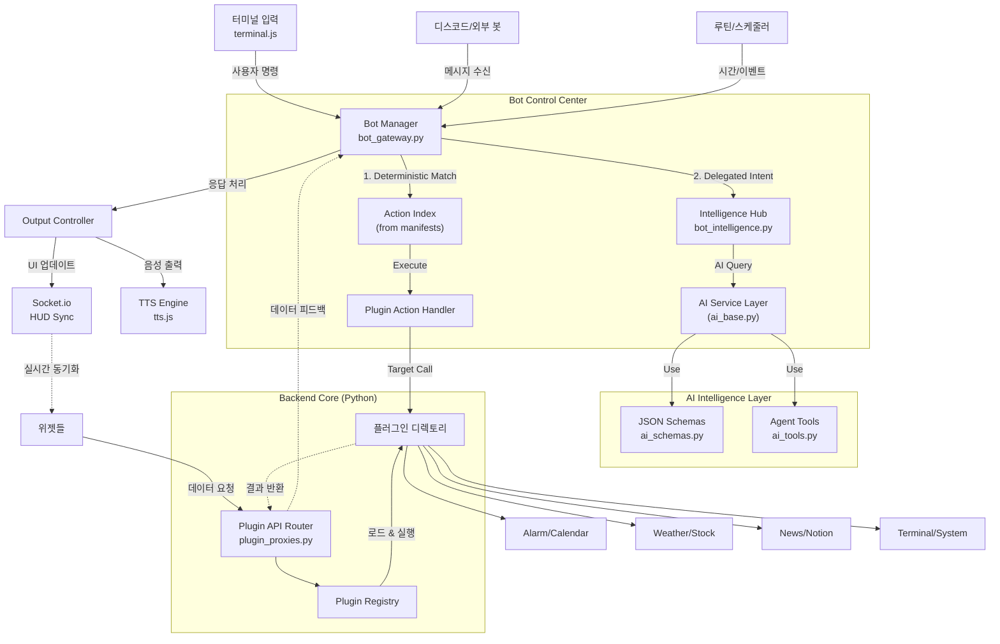
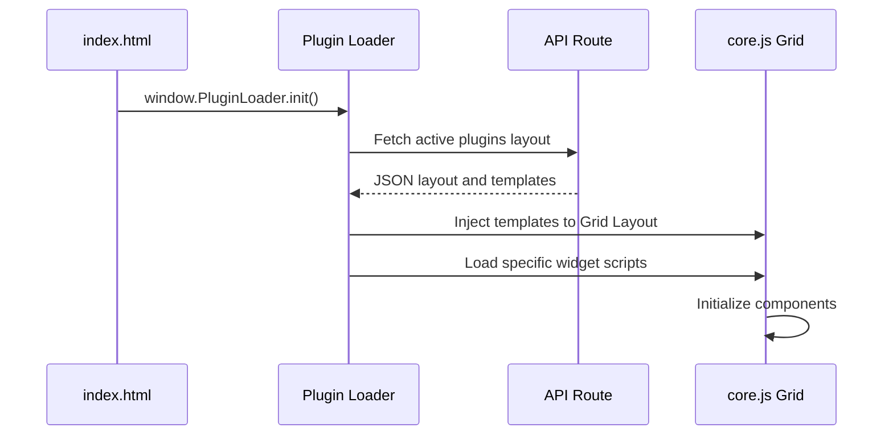
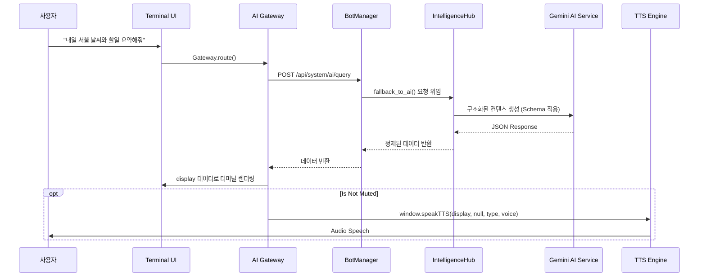

# AEGIS System Architecture

본 문서는 AEGIS 대시보드 시스템의 종합적인 아키텍처, 데이터 흐름, 디자인 패턴 철학, 루틴 매니저 동작 원리 및 환경 변수 구조를 상세히 정의합니다. 새로운 인스턴스가 코드를 파악할 때 필수적인 레퍼런스로 활용되며, 일관성 없는 코드 수정을 방지하는 역할을 합니다.

---

## 1. System Overview (시스템 개요)

AEGIS는 독자적인 **"Plugin-X"** 아키텍처와 **"Determinism First"** 원칙을 기반으로 설계된 모듈식 AI 대시보드 시스템입니다. 파이썬 Flask 기반의 백엔드와 Vanilla JS 기반의 프론트엔드가 REST API 및 WebSocket(Socket.io) 레이어를 통해 실시간으로 통신합니다.

### 1.1 High-Level Architecture (v3.7.0)

---

## 2. Design Pattern & Philosophy (디자인 패턴 및 철학)

AEGIS는 철저한 **모듈화(Modularity)**와 **확정적 제어(Deterministic Control)** 원칙을 따릅니다.

1.  **Plugin-X Architecture:**
    *   모든 확장 기능을 독립된 폴더(`plugins/`)로 격리합니다. 각 플러그인은 `manifest.json`을 통해 자신의 메타데이터, 보안 권한, **고정 액션(Actions)**을 정의합니다.
2.  **Determinism First (v3.7.0):**
    *   AI의 환각(Hallucination)을 방지하기 위해 사용자의 의도가 명확한 명령어(예: `/재생`, `/알람`)는 AI 판단을 거치지 않고 등록된 핸들러로 즉시 라우팅합니다.
3.  **Tiered Messaging Hub:**
    *   모든 입력은 `BotManager`로 집결되나, 처리는 계층화되어 있습니다. `BotManager`는 배송(Routing)에 집중하고, 복잡한 인지(Intelligence)는 `IntelligenceHub`가, 저수준 AI 통신은 `ai_base`가 전담합니다.
4.  **Event-Driven Sync:**
    *   상태 변화가 발생하면 `sync_cmd` 프로토콜을 사용하여 WebSocket을 통해 모든 연결된 클라이언트(Web UI, Desktop HUD)의 화면을 동시 동기화합니다.
5.  **Schema-Driven AI & Centralized Registry:**
    *   `ai_schemas.py`를 통해 모든 AI 응답 규격을 중앙 관리하여 파싱 에러를 원천 차단하고 시스템 일관성을 유지합니다.

---

## 3. Environment Variables & Configuration (환경 변수 및 설정)

AEGIS는 소스코드 하드코딩을 방지하기 위해 정교한 설정 파일 시스템을 운영합니다.

*   **`config/secrets.json` (보안 키 관리):**
    *   `NOTION_TOKEN`, `WEATHER_API_KEY`, `GOOGLE_OAUTH_CLIENT_SECRET`, `GEMINI_API_KEY` 등 모든 외부 API 연동 키가 보관됩니다. (Git에 올라가지 않아야 함)
*   **`config/api.json` (시스템 동작 설정):**
    *   시스템 초기화에 필요한 정보(호스트, 포트, 인증 모드(Local/Google), 활성화할 플러그인 목록)를 관리합니다.
*   **`config/settings.json` (사용자 설정):**
    *   UI 테마, 언어(`lang`), 글꼴 등 런타임에 동적으로 변경되는 브라우저 관련 설정들을 지속성(Persistence) 있게 저장합니다.
*   **환경 호환성 (OS/Render.com):**
    *   프로덕션 모델인 Linux 기반의 플랫폼(Render) 배포를 고려하여 모든 경로 탐색은 `os.path.join`을 사용하며, 필요한 보안 키는 운영 서버의 환경 변수(Environment Variables)에서 직접 주입할 수 있도록 설계되어 있습니다.

---

## 4. Routine Manager & Scheduler (루틴 매니저 동작 원리)

AEGIS가 사용자의 개입 없이 능동적으로 동작(Proactive)할 수 있게 만드는 핵심 심장부입니다. 프론트엔드의 `briefing_scheduler.js` 와 백엔드의 `plugins/scheduler` 가 협력하여 작동합니다.

1.  **폴링(Polling) 루프 매커니즘:**
    *   프론트엔드 루틴 매니저(`briefing_scheduler.js`)는 `setInterval`을 이용해 주기적으로 현재 시각을 확인합니다. (1분/1초 단위)
2.  **스케줄 및 조건 비교:**
    *   백엔드에서 미리 설정된 루틴(JSON 설정 - 예: "오전 8시에 날씨 요약", "매시간 정각에 명언 요약")과 현재 시간을 비교합니다.
3.  **자동화 실행 (Routine Execution):**
    *   트리거 타이밍이 맞으면 루틴 매니저는 브리퍼(Briefing Manager) 또는 AI 게이트웨이를 백그라운드에서 호출합니다.
    *   백엔드는 등록된 플러그인(예: Weather, Notion) 패키지에서 데이터를 취합하고 `AI Service`를 호출하여 요약 컨텐츠를 생성합니다.
4.  **자동 사운드 및 모션 매핑:**
    *   AI가 작성한 요약(`briefing`) 텍스트와 감정 상태는 즉각적으로 `tts.js` 로 넘어가 음성으로 출력되며, 모션 엔진을 통해 UI 아바타의 감정 모션이 자동 발동합니다.

---

## 5. Core Modules & Managers (핵심 제어 모듈)

### 5.1 Bot Messaging Hub (`bot_gateway.py` & `bot_intelligence.py`) [v3.7.1]
*   **BotManager:** 메시지 수신, 권한 검증, 어댑터 관리 및 명령어 라우팅 총괄.
*   **IntelligenceHub:** AI 인지 레이어. 프롬프트 생성, 액션 태그 파싱, NLP 폴백 로직 전담.
*   **BotAdapter:** 플랫폼 독립성을 보장하는 외부 봇 추상화 인터페이스 (`bot_adapters.py`).
*   **3단계 명령어 모델 (3-Tier Command System):**
    1.  **Systematic (/)**: 100% 확정적 실행. `manifest.json` 액션과 1:1 매칭되며, 실패 시 AI로 넘어가지 않고 즉시 종료됩니다. (Quota 및 비용 최적화)
    2.  **Hybrid (/@)**: 플러그인 컨텍스트(@별명) + AI 지능 결합. 자연어 해석이 필요한 지능형 명령에 사용됩니다.
    3.  **Pure AI (/# 또는 #)**: 컨텍스트 없는 순수 AI 지식 및 외부 검색 강제 수행.

### 5.2 AI Intelligence Layer (`gemini_service.py`) [v3.7.0]
*   **GeminiClientWrapper (`ai_base.py`):** AI 클라이언트 설정 및 공통 통신 레이어.
*   **Centralized Schemas (`ai_schemas.py`):** 브리핑 및 명령 파싱 응답 규격 저장소.
*   **Agent Tools (`ai_tools.py`):** AI가 실행 가능한 기능(웹 검색, 시스템 조회)들의 모듈화된 집합.

### 5.3 Plugin Registry (`services/plugin_registry.py`)
*   **역할:** 플러그인 전역 등록부 및 데이터 브로커.
*   **기능:** `Context Provider`(브리핑 데이터 제공), `Action Handler`(실제 기능 실행), `Deterministic Index`(명령어 역발행 색인)를 통합 관리합니다.

### 5.4 TTS Engine (`tts.js`)
*   **역할:** 시스템의 단일 음성 출력 엔드포인트. AI의 `briefing` 응답을 처리합니다.
*   **규격:** `window.speakTTS(text, audioUrl, visualType, speechText)`
    *   외부 매니저들은 절대 자체적으로 오디오 객체를 만들어 재생하지 않아야 하며, 반드시 위 함수에 `speechText`(마크다운이 제거된 순수 문자)를 주입하여 호출해야 버그를 피할 수 있습니다.

---

## 6. Core Widgets & Plugins (주요 위젯 구조)

AEGIS의 개별 기능들은 각자의 독립성을 유지한 채 폴더별로 격리 관리됩니다.

*   **Plugin-X Standard:** 모든 플러그인은 `manifest.json`, `router.py`, `service.py`, `index.js`, `style.css` 구조를 따릅니다.
*   **Action Registration:** 플러그인의 `router.py` 내 `initialize_plugin()` 함수는 로드 시점에 `register_plugin_action`을 호출하여 자신의 기능을 시스템 명령어로 노출합니다.
*   **Terminal Widget (`terminal`):** 사용자가 시스템에 쿼리를 전송하는 메인 커맨드 허브입니다. 백엔드와 프론트엔드를 넘나들며 시스템을 제어합니다.
    *   **HUD 스타일 디자인:** 일반적인 위젯이 아닌 전체 화면이나 상단에서 떨어지는 형태(Quake 스타일)로, 단축키(`Shift + ~` 또는 `\``)로 전역 호출이 가능합니다. (`Escape`로 닫기)
    *   **동작 원리:** 
        1.  사용자가 입력을 마치고 `Enter`를 누르면 `TerminalUI.appendLog`를 거쳐 `window.CommandRouter.route(cmd, model)`로 전달됩니다.
        2.  로컬에서 파싱할 명령어(예: `/help`, `/term`)는 프론트엔드에서 즉시 자체 처리하고, 그 외에는 `ai_gateway.js`를 거쳐 백엔(`POST /api/system/ai/query`)으로 전달합니다.
    *   **단축어/자체 명령어 플러그인 등록:**
        *   플러그인 로더 컴포넌트(`core.js` 등)의 `context.registerCommand(cmd, callback)` 인터페이스를 통해 자체 명령어를 동적으로 무한정 등록할 수 있습니다.
        *   **예시 (터미널 설정 제어 명령어):**
            `/term height 70` -> 터미널 창의 높이를 70vh로 동적 조절합니다.
            `/term lines 300` -> 로그 한도 줄 수를 300줄로 늘립니다.
    *   **주요 연동 파라미터 및 전역 함수:**
        *   `window.appendLog(source, message, isDebug)`: 화면에 시스템 메시지나 에러 로그를 직접 뿌려주는 전역 API 함수. 모든 모듈이 접근 가능.
        *   `modelSelector`: `Gemini`, `Ollama(Llama3 등)` 다른 외부 AI 처리 엔진으로 온더플라이 전환. 프론트엔드에서 `window.AEGIS_AI_MODEL`에 할당되어 라우팅 시 백엔드로 패스됩니다.
*   **System Profile / Title Widget (`system-stats`):** 시스템 IP, CPU/RAM 점유율, 사용자 환영 메시지 등 동적 정보 출력.
*   **Wallpaper Widget (`wallpaper`):** 사진/동영상을 백그라운드 캔버스에 표시하며 관리용 API 세트를 제공.
*   **Notion Task & Calendar (`notion-task`):** 노션 API를 통한 실시간 일정과 칸반 보드 카드 로딩. (주기적 데이터 리로드 방식 적용)
*   **AI Studio (`studio`):** 브라우저와 PC 내 VTS(Vtube Studio)를 연결하여 아바타의 모델 관리 및 감정/리액션 스크립트를 관리하는 컨트롤 센터.
*   **Alarm Plugin (`alarm`):** 사용자 루틴과 연동되는 지능형 알람 시스템입니다. AI가 직접 알람을 설정(`[ACTION] SET_ALARM`)하거나 대시보드에서 관리할 수 있으며, 모든 데이터는 표준 API를 통해 정밀하게 동기화됩니다.

---

## 7. Component Interaction Sequence (컴포넌트 상호작용)

### 사례 1: 대시보드 초기화 및 위젯 마운트(Mount)

### 사례 2: 복합 AI 질문 처리 로직 (v3.7.0 모듈화 버전)

명령어, API, TTS가 어떻게 엮이는지 보여줍니다. 특히, 백엔드는 포맷팅에 집중하고 UI 제어는 프론트엔드가 전담합니다.

---

## 8. System Design Principles (설계 및 개발 준수 사항)

AI 인스턴스가 AEGIS 내의 코드를 수정할 대는 다음 설계 규약을 **엄격히** 준수해야 합니다.

1. **Plugin-X 캡슐화 위반 금지:**
   * 글로벌로 사용해야 할 공통 라이브러리 외에 특정한 기능(예: 특정 달력 조회 기능)을 코어 파일(`app_factory.py`, `gods.py`)에 하드코딩하지 마십시오. 새로운 기능은 무조건 `plugins/새_기능/` 폴더 내에 구축해야 합니다.
2. **Schema-Driven 통신 강제 & 중앙화:**
   * LLM을 사용해 데이터를 처리하는 경우, AI가 임박한 텍스트로 답하도록 두지 마십시오. 반드시 `ai_schemas.py`에 정의된 규격을 사용해 JSON 포맷으로 받도록 코딩합니다.
3. **(경고) Gemini Search Tools 충돌 회피:**
   * Gemini 2.0+ 버전 호출 중 구조화된 JSON 출력을 받을 때 `Search` 속성이 활성화되어 있으면 400 에러가 납니다. API 호출 설정 시 반드시 `tools=[]`를 강제 선언하여 방지하십시오.
4. **OS 환경 호환성 방어:**
   * 개발 환경(Windows)에만 국한되지 않는 코드를 짭니다. 절대 `C:\` 등의 절대경로를 하드코딩하지 말고, `os.path.join(BASE_DIR, ...)` 를 사용하여 리눅스(Render.com 등) 베포 시 경로 브레이크를 유발하지 않도록 합니다.
5. **No Direct DOM Injection on Output:**
   * AI의 응답을 그대로 `Element.innerHTML`에 집어넣는 XSS 유발 코드를 금지합니다. 제공되는 `marked.js` 모듈이나 컴포넌트 데이터 바인딩 패턴을 사용하세요.
