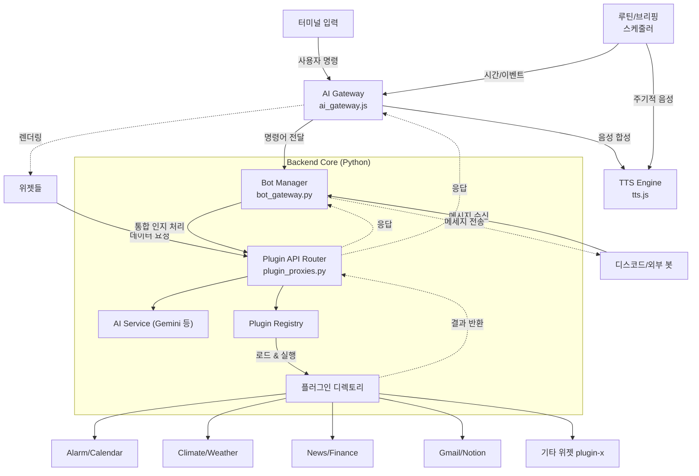
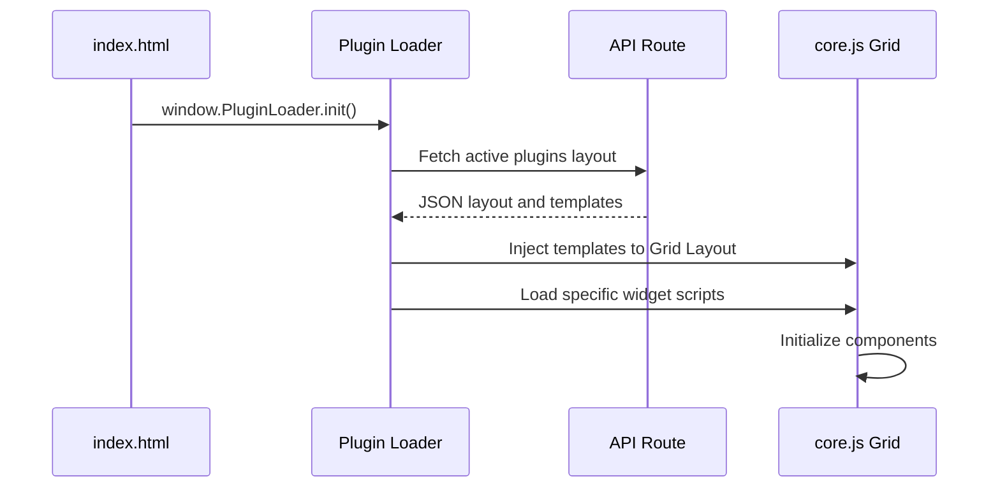
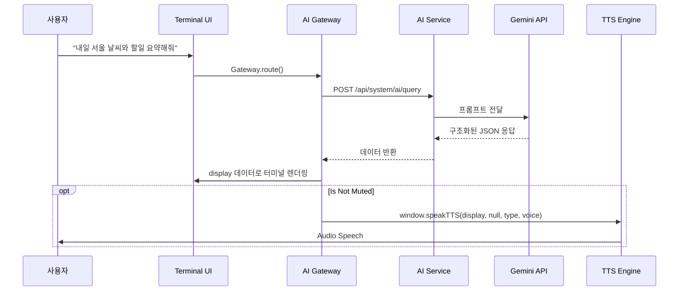

# AEGIS System Architecture

본 문서는 AEGIS 대시보드 시스템의 종합적인 아키텍처, 데이터 흐름, 디자인 패턴 철학, 루틴 매니저 동작 원리 및 환경 변수 구조를 상세히 정의합니다. 새로운 인스턴스가 코드를 파악할 때 필수적인 레퍼런스로 활용되며, 일관성 없는 코드 수정을 방지하는 역할을 합니다.

---

## 1. System Overview (시스템 개요)

AEGIS는 독자적인 **"Plugin-X"** 아키텍처를 기반으로 설계된 모듈식 AI 대시보드 시스템입니다. 파이썬 Flask 기반의 백엔드와 Vanilla JS 기반의 프론트엔드가 REST API 레이어를 통해 통신합니다.

### 1.1 High-Level Architecture

---

## 2. Design Pattern & Philosophy (디자인 패턴 및 철학)

AEGIS는 철저한 **모듈화(Modularity)**와 **관심사 분리(Separation of Concerns)** 원칙을 따릅니다.

1. **Plugin-X Architecture:**
   * 핵심 코어를 가볍게 유지하고, 모든 확장 기능(날씨, 캘린더, 배경화면 등)을 독립된 폴더(`plugins/`)로 분리합니다.
   * 각 플러그인은 자체 라우터(`app.py`), 프론트엔드 에셋(`index.js`, `style.css`), 환경설정을 포함하는 **자기 완결적(Self-Contained)** 구조를 가집니다.
2. **Frontend-Backend Decoupling (프론트/백엔드 분리):**
   * Jinja 템플릿 등을 사용하여 서버가 직접 HTML을 렌더링하는 것을 지양합니다 (초기 컨테이너 주입 제외). 모든 데이터 교환은 JSON 기반의 REST API를 통해 이루어집니다.
3. **Event-Driven Communication (이벤트 기반 통신):**
   * 위젯들은 서로 직접 참조하지 않습니다. 전역 객체(`window.reactionEngine`, `window.speakTTS`)나 커스텀 이벤트를 통해 느슨하게 결합(Loosely Coupled)되어 통신합니다.
4. **Schema-Driven AI (스키마 기반 AI 제어):**
   * 자유도 높은 LLM 호출 대신 강제된 JSON 스키마(`response_schema` - 보통 `display`, `voice`, `sentiment` 구조)를 적용하여 응답 품질을 관리하고 파싱 에러를 원천 차단합니다.

---

## 3. Environment Variables & Configuration (환경 변수 및 설정)

AEGIS는 소스코드 하드코딩을 방지하기 위해 정교한 설정 파일 시스템을 운영합니다.

* **`config/secrets.json` (보안 키 관리):**
  * `NOTION_TOKEN`, `WEATHER_API_KEY`, `GOOGLE_OAUTH_CLIENT_SECRET`, `GEMINI_API_KEY` 등 모든 외부 API 연동 키가 보관됩니다. (Git에 올라가지 않아야 함)
* **`config/api.json` (시스템 동작 설정):**
  * 시스템 초기화에 필요한 정보(호스트, 포트, 인증 모드(Local/Google), 활성화할 플러그인 목록)를 관리합니다.
* **`config/settings.json` (사용자 설정):**
  * UI 테마, 언어(`lang`), 글꼴 등 런타임에 동적으로 변경되는 브라우저 관련 설정들을 지속성(Persistence) 있게 저장합니다.
* **환경 호환성 (OS/Render.com):**
  * 프로덕션 모델인 Linux 기반의 플랫폼(Render) 배포를 고려하여 모든 경로 탐색은 `os.path.join`을 사용하며, 필요한 보안 키는 운영 서버의 환경 변수(Environment Variables)에서 직접 주입할 수 있도록 설계되어 있습니다.

---

## 4. Routine Manager & Scheduler (루틴 매니저 동작 원리)

AEGIS가 사용자의 개입 없이 능동적으로 동작(Proactive)할 수 있게 만드는 핵심 심장부입니다. 프론트엔드의 `briefing_scheduler.js` 와 백엔드의 `plugins/scheduler` 가 협력하여 작동합니다.

1. **폴링(Polling) 루프 매커니즘:**
   * 프론트엔드 루틴 매니저(`briefing_scheduler.js`)는 `setInterval`을 이용해 주기적으로 현재 시각을 확인합니다. (1분/1초 단위)
2. **스케줄 및 조건 비교:**
   * 백엔드에서 미리 설정된 루틴(JSON 설정 - 예: "오전 8시에 날씨 요약", "매시간 정각에 명언 요약")과 현재 시간을 비교합니다.
3. **자동화 실행 (Routine Execution):**
   * 트리거 타이밍이 맞으면 루틴 매니저는 브리퍼(Briefing Manager) 또는 AI 게이트웨이를 백그라운드에서 호출합니다.
   * 백엔드는 등록된 플러그인(예: Weather, Notion) 패키지에서 데이터를 취합하고 `AI Service`를 호출하여 요약 컨텐츠를 생성합니다.
4. **자동 사운드 및 모션 매핑:**
   * AI가 작성한 요약(`briefing`) 텍스트와 감정 상태는 즉각적으로 `tts.js` 로 넘어가 음성으로 출력되며, 모션 엔진을 통해 UI 아바타의 감정 모션이 자동 발동합니다.

---

## 5. Core Modules & Managers (핵심 제어 모듈)

### 5.1 AI Gateway (`ai_gateway.js` / 백엔드 `ai_service.py`)
* **역할:** 터미널 명령 라우팅 및 LLM 쿼리 제어 통로.
* **로컬 명령 파싱:** 플래그 옵션(`--mute`), alias를 정규식으로 감지.
* **응답 분배:** `display`(UI 렌더러행)와 `briefing/voice`(TTS 엔진행) 데이터를 완벽히 분리.

### 5.2 TTS Engine (`tts.js`)
* **역할:** 시스템 내 유일한 **단일 음성 출력 엔드포인트(Single Point of Truth for Audio)**입니다.
* **규격:** `window.speakTTS(text, audioUrl, visualType, speechText)`
  * 외부 매니저들은 절대 자체적으로 오디오 객체를 만들어 재생하지 않아야 하며, 반드시 위 함수에 `speechText`(마크다운이 제거된 순수 문자)를 주입하여 호출해야 버그를 피할 수 있습니다.

### 5.3 External API Manager (`external_api_manager.js`)
* **역할:** 외부 스크립트 기반 챗봇(예: OpenClaw) 혹은 외부 시스템에서 HTTP로 강제 주입하는 액션(명령/모션/음성) 이벤트를 수신하여 내부망으로 디스패치(Dispatch)합니다. 폴링 방식 기반 큐를 가집니다.

### 5.4 Messaging Hub (`BotManager` / `bot_gateway.py`) [v3.4.0]
* **역할:** 웹 터미널, 디스코드, 텔레그램 등 모든 플랫폼의 메시징 입출력을 통합 관리하는 '인지 로직 중심부'입니다.
* **통합 명령어 체계:** `/@` (Hybrid), `/` (Local), `/#` (Search) 명령어 기호를 모든 플랫폼에서 동일하게 해석합니다.
* **약한 결합 어댑터:** `BotAdapter` 추상 인터페이스를 통해 새로운 플랫폼(Discord 등)을 코드 수정 없이 추가할 수 있는 구조를 제공합니다.
* **다국어 자동 전환:** `utils.get_i18n()`을 통해 사용자별 언어 환경에 맞춘 시스템 지침을 AI에게 공급합니다.

---

## 6. Core Widgets & Plugins (주요 위젯 구조)

AEGIS의 개별 기능들은 각자의 독립성을 유지한 채 폴더별로 격리 관리됩니다.

* **Terminal Widget (`terminal`):** 사용자가 시스템에 쿼리를 전송하는 메인 커맨드 허브입니다. 백엔드와 프론트엔드를 넘나들며 시스템을 제어합니다.
  * **HUD 스타일 디자인:** 일반적인 위젯이 아닌 전체 화면이나 상단에서 떨어지는 형태(Quake 스타일)로, 단축키(`Shift + ~` 또는 `\``)로 전역 호출이 가능합니다. (`Escape`로 닫기)
  * **동작 원리:** 
    1. 사용자가 입력을 마치고 `Enter`를 누르면 `TerminalUI.appendLog`를 거쳐 `window.CommandRouter.route(cmd, model)`로 전달됩니다.
    2. 로컬에서 파싱할 명령어(예: `/help`, `/term`)는 프론트엔드에서 즉시 자체 처리하고, 그 외에는 `ai_gateway.js`를 거쳐 백엔드(`POST /api/system/ai/query`)로 전달합니다.
  * **단축어/자체 명령어 플러그인 등록:**
    * 플러그인 로더 컴포넌트(`core.js` 등)의 `context.registerCommand(cmd, callback)` 인터페이스를 통해 자체 명령어를 동적으로 무한정 등록할 수 있습니다.
    * **예시 (터미널 설정 제어 명령어):**
      `/term height 70` -> 터미널 창의 높이를 70vh로 동적 조절합니다.
      `/term lines 300` -> 로그 한도 줄 수를 300줄로 늘립니다.
  * **주요 연동 파라미터 및 전역 함수:**
    * `window.appendLog(source, message, isDebug)`: 화면에 시스템 메시지나 에러 로그를 직접 뿌려주는 전역 API 함수. 모든 모듈이 접근 가능.
    * `modelSelector`: `Gemini`, `Ollama(Llama3 등)` 다른 외부 AI 처리 엔진으로 온더플라이 전환. 프론트엔드에서 `window.AEGIS_AI_MODEL`에 할당되어 라우팅 시 백엔드로 패스됩니다.
* **System Profile / Title Widget (`system-stats`):** 시스템 IP, CPU/RAM 점유율, 사용자 환영 메시지 등 동적 정보 출력.
* **Wallpaper Widget (`wallpaper`):** 사진/동영상을 백그라운드 캔버스에 표시하며 관리용 API 세트를 제공.
* **Notion Task & Calendar (`notion-task`):** 노션 API를 통한 실시간 일정과 칸반 보드 카드 로딩. (주기적 데이터 리로드 방식 적용)
* **AI Studio (`studio`):** 브라우저와 PC 내 VTS(Vtube Studio)를 연결하여 아바타의 모델 관리 및 감정/리액션 스크립트를 관리하는 컨트롤 센터.
* **Alarm Plugin (`alarm`):** 사용자 루틴과 연동되는 지능형 알람 시스템입니다. AI가 직접 알람을 설정(`[ACTION] SET_ALARM`)하거나 대시보드에서 관리할 수 있으며, 모든 데이터는 표준 API를 통해 정밀하게 동기화됩니다.

---

## 7. Component Interaction Sequence (컴포넌트 상호작용)

### 사례 1: 대시보드 초기화 및 위젯 마운트(Mount)

### 사례 2: 복합 AI 질문 처리 로직

명령어, API, TTS가 어떻게 엮이는지 보여줍니다. 특히, 백엔드는 포맷팅에 집중하고 UI 제어는 프론트엔드가 전담합니다.

---

## 8. System Design Principles (설계 및 개발 준수 사항)

AI 인스턴스가 AEGIS 내의 코드를 수정할 대는 다음 설계 규약을 **엄격히** 준수해야 합니다.

1. **Plugin-X 캡슐화 위반 금지:**
   * 글로벌로 사용해야 할 공통 라이브러리 외에 특정한 기능(예: 특정 달력 조회 기능)을 코어 파일(`app_factory.py`, `gods.py`)에 하드코딩하지 마십시오. 새로운 기능은 무조건 `plugins/새_기능/` 폴더 내에 구축해야 합니다.
2. **Schema-Driven 통신 강제:**
   * LLM을 사용해 데이터를 처리하는 경우, AI가 임박한 텍스트로 답하도록 두지 마십시오. `generate_content` 호출 시 반드시 `response_schema` 파라미터를 사용해 `display`와 `voice` 키를 갖춘 JSON 포맷으로 받도록 코딩합니다.
3. **(경고) Gemini Search Tools 충돌 회피:**
   * Gemini 2.0+ 버전 호출 중 구조화된 JSON 출력을 받을 때 `Search` 속성이 활성화되어 있으면 400 에러가 납니다. API 호출 설정 시 반드시 `tools=[]`를 강제 선언하여 방지하십시오.
4. **OS 환경 호환성 방어:**
   * 개발 환경(Windows)에만 국한되지 않는 코드를 짭니다. 절대 `C:\` 등의 절대경로를 하드코딩하지 말고, `os.path.join(BASE_DIR, ...)` 를 사용하여 리눅스(Render.com 등) 베포 시 경로 브레이크를 유발하지 않도록 합니다.
5. **No Direct DOM Injection on Output:**
   * AI의 응답을 그대로 `Element.innerHTML`에 집어넣는 XSS 유발 코드를 금지합니다. 제공되는 `marked.js` 모듈이나 컴포넌트 데이터 바인딩 패턴을 사용하세요.
