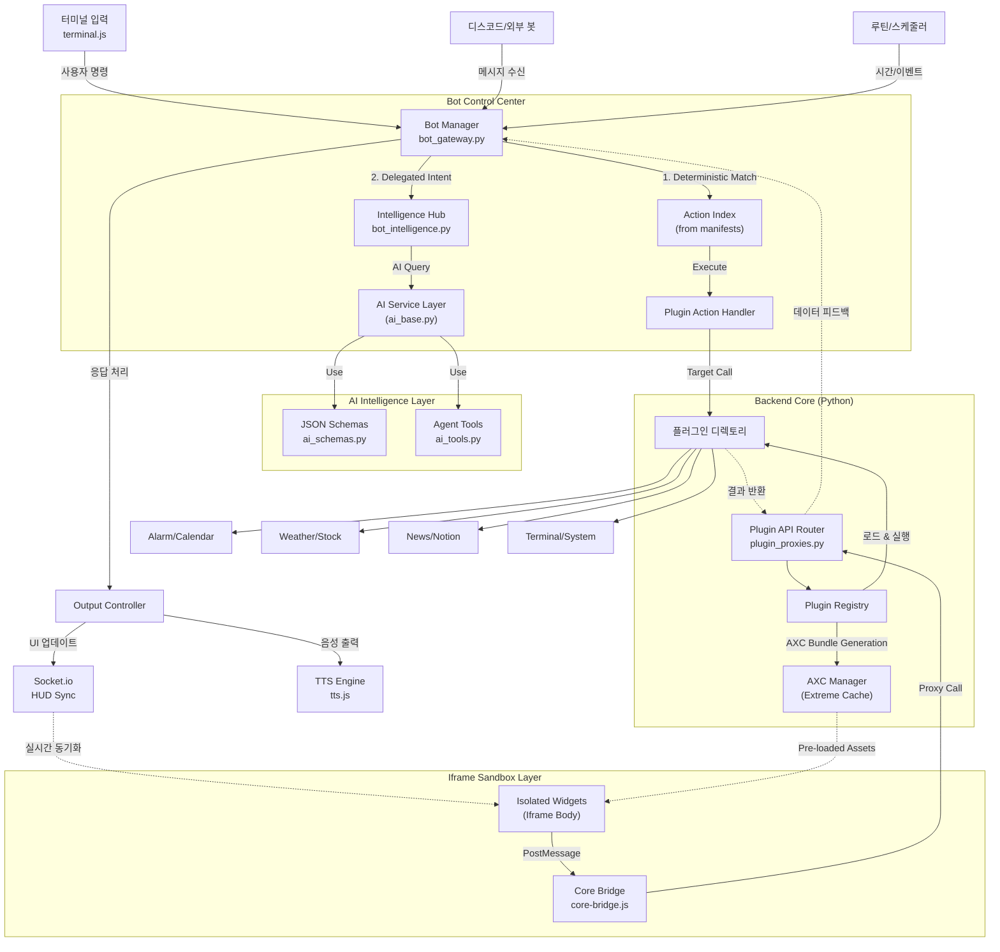

# AEGIS System Architecture (v4.0.0)

본 문서는 AEGIS 대시보드 시스템의 종합적인 아키텍처, 데이터 흐름, 디자인 패턴 철학, 루틴 매니저 동작 원리 및 환경 변수 구조를 상세히 정의합니다. v4.0.0부터 도입된 **Iframe Isolation**, **AXC**, **Parallel Hydration** 등 최신 기술 사양을 포함하며, 시스템의 일관성과 보안을 유지하기 위한 필수 레치런스로 활용됩니다.

---

## 1. System Overview (시스템 개요)

AEGIS는 독자적인 **"Plugin-X"** 아키텍처와 **"Determinism First"** 원칙을 기반으로 설계된 모듈식 AI 대시보드 시스템입니다. v4.0부터는 더욱 강력한 **물리적 격리(Iframe Isolation)**와 **초고속 로딩(AXC)**을 통해 사용자 경험과 보안성을 동시에 확보했습니다.

### 1.1 High-Level Architecture (v4.0.0)

v4.0 아키텍처의 핵심은 **Iframe 기반의 샌드박스**와 **AXC를 통한 병렬 하이드레이션**입니다.

---

## 2. Design Pattern & Philosophy (디자인 패턴 및 철학)

AEGIS v4.0은 철저한 **격리(Isolation)**와 **확정적 제어(Deterministic Control)** 원칙을 따릅니다.

### 2-1. Plugin-X v4.0 Architecture
- **Iframe 물리 격리**: 모든 위젯은 독립된 Iframe 내에서 실행됩니다. 이는 레거시 Shadow DOM의 한계(Global CSS 변수 오염, JS 전역 객체 충돌 등)를 물리적으로 해결합니다.
- **Capability Proxy (Context API)**: 위젯은 시스템 자원에 직접 접근할 수 없으며, 주입된 `context` 객체를 통해서만 통신합니다.

### 2-2. AXC (AEGIS Extreme Cache)
- **Extreme Speed**: 모든 플러그인 자산(HTML/JS/CSS)을 SHA256 해시 기반의 단일 번들로 묶어 클라이언트 IndexedDB에 캐싱합니다.
- **Zero Latency**: 네트워크 상태와 무관하게 모든 위젯이 10ms 이내에 로드됩니다.

### 2-3. Parallel Hydration
- **Async Injection**: 메인 UI의 레이아웃(Grid)을 먼저 생성한 뒤, 각 Iframe에 자산을 병렬로 주입합니다. 로딩 중 UI 블로킹을 방지합니다.

### 2-4. Determinism First
- AI의 환각(Hallucination)을 방지하기 위해 사용자의 명확한 의도(Command)는 `manifest.json`에 정의된 확정적 액션 핸들러로 즉시 라우팅됩니다.

### 2-5. Event Delegation Standard
- 성능과 안정성을 위해 개별 DOM 요소에 인라인 이벤트를 할당하지 않고, `root` 엘리먼트에서 `data-action` 기반으로 이벤트를 통합 관리합니다.

---

## 3. Environment Variables & Configuration (환경 변수 및 설정)

AEGIS는 소스코드 하드코딩을 방지하기 위해 정교한 설정 파일 시스템을 운영하며, 클라우드 배포(Render.com 등)를 완벽히 지원합니다.

*   **`config/secrets.json` (보안 키 관리):**
    *   `NOTION_TOKEN`, `WEATHER_API_KEY`, `GOOGLE_OAUTH_CLIENT_SECRET`, `GEMINI_API_KEY` 등 모든 외부 API 연동 키가 보관됩니다.
*   **`config/api.json` (시스템 동작 설정):**
    *   시스템 초기화 정보(호스트, 포트, 인증 모드)를 관리합니다.
*   **`config/settings.json` (사용자 설정):**
    *   UI 테마, 언어(`lang`), 글꼴 등 런타임 설정을 저장합니다.
*   **환경 호환성 (OS Protection):**
    *   Windows와 Linux(Render) 간의 경로 호환성을 위해 `os.path.join`을 필수 사용하며, 환경 변수(`os.environ`)를 통한 비밀 키 주입을 지원합니다.

---

## 4. Routine Manager & Scheduler (루틴 매니저 동작 원리)

AEGIS가 능동적으로 동작(Proactive)할 수 있게 만드는 핵심 심장부입니다.

1.  **폴링(Polling) 루프 매커니즘:**
    *   프론트엔드의 `briefing_scheduler.js` 가 주기적으로 현재 시각과 등록된 루틴을 비교합니다.
2.  **스케줄 및 조건 비교:**
    *   백엔드(`plugins/scheduler`)에서 전달된 루틴 조건(시간, 센서 데이터 등)을 확인합니다.
3.  **자동화 실행 (Routine Execution):**
    *   트리거 발생 시 `Briefing Manager`를 호출하여 각 플러그인의 데이터(Context)를 수집하고 AI를 통해 요약 컨텐츠를 생성합니다.
4.  **자동 사운드 및 모션 매핑:**
    *   결과물은 즉각적으로 `tts.js` 와 스튜디오 리액션 엔진으로 전달되어 발화 및 아바타 동작을 수행합니다.

---

## 5. Core Modules & Managers (핵심 제어 모듈)

### 5.1 Bot Messaging Hub (`bot_gateway.py` & `bot_intelligence.py`)
*   **BotManager:** 메시지 수신, 권한 검증 및 명령어 라우팅 총괄.
*   **IntelligenceHub:** AI 인지 레이어. NLP 폴백 및 액션 태그 파싱 전담.
*   **3-Tier Command System:**
    1.  **Systematic (/)**: 확정적 실행 (Manifest Actions).
    2.  **Hybrid (/@)**: 컨텍스트 + AI 조합.
    3.  **Pure AI (/#)**: 순수 AI 지식 기반 처리.

### 5.2 AI Intelligence Layer (`gemini_service.py`)
*   **GeminiClientWrapper**: Google Gemini API 통신 래퍼.
*   **Centralized Schemas (`ai_schemas.py`):** 모든 AI 응답의 JSON 규격을 중앙 관리하여 파싱 에러 방지.
*   **Agent Tools (`ai_tools.py`):** AI가 실행 가능한 기능들의 모듈화된 집합.

### 5.3 Plugin Registry & Security
*   **Registry**: 플러그인의 `Context Provider`와 `Action Handler`를 관리합니다.
*   **Security Service**: 플러그인이 허용된 API 수준과 경로를 준수하는지 런타임에 검사합니다.

### 5.4 Hybrid Render & Sandbox
*   **HybridRenderer**: 위젯의 `hybrid_level`에 따라 Iframe 격리 또는 시스템 직접 주입(Level 1)을 결정합니다.
*   **Sandbox Bridge**: Iframe 내부와 외부 간의 안전한 통신을 위한 PostMessage API 래퍼입니다.

---

## 6. Hybrid Levels & Plugin-X Standards

AEGIS v4.0은 각 위젯의 중요도와 기능에 따라 3단계 격리 수준을 지원합니다.

| 레벨 | 명칭 | 설명 |
|---|---|---|
| **Level 1** | System Internal | 대시보드 코어와 동일한 DOM 레벨에서 실행 (wallpaper, sidebar 등 시스템 UI) |
| **Level 2** | Standard Iframe | **[v4.0 표준]** 완전히 격리된 Iframe 내에서 실행. 대다수의 타사 플러그인에 적용 |
| **Level 3** | Hybrid Advanced | Iframe 격리를 유지하면서도 특정 시스템 리소스에 대한 직접적인 채널을 확보 |

---

## 7. System Design Principles (설계 및 개발 준수 사항)

1. **캡슐화 엄수**: 모든 기능은 반드시 `plugins/` 하위에 독립적으로 구축해야 하며, `app_factory.py` 수정을 금지합니다.
2. **Schema-Driven Coding**: AI 응답 처리는 반드시 `ai_schemas.py`의 형식을 따라야 합니다.
3. **OS 환경 호환성**: 모든 경로 처리는 크로스 플랫폼을 고려하여 작성합니다.
4. **No Direct DOM Injection on Output**: XSS 방지를 위해 AI 응답 텍스트는 반드시 검증된 렌더러(`marked.js` 등)를 거칩니다.
5. **Event Stop Propagation**: Iframe 위젯 내의 모든 인터랙티브 요소는 위젯 드래그 이벤트 간섭을 막기 위해 `e.stopPropagation()`을 호출해야 합니다.

---
**AEGIS Architecture v4.0.0 Global Standard**
**이 문서는 v4.0 아키텍처 개편 내용을 완벽히 반영하며, 레거시 용어를 정제한 공식 문서입니다.**
