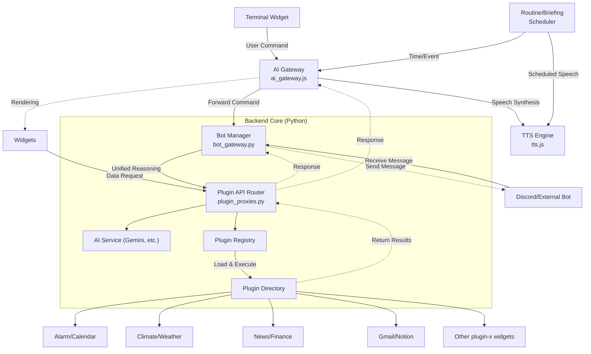
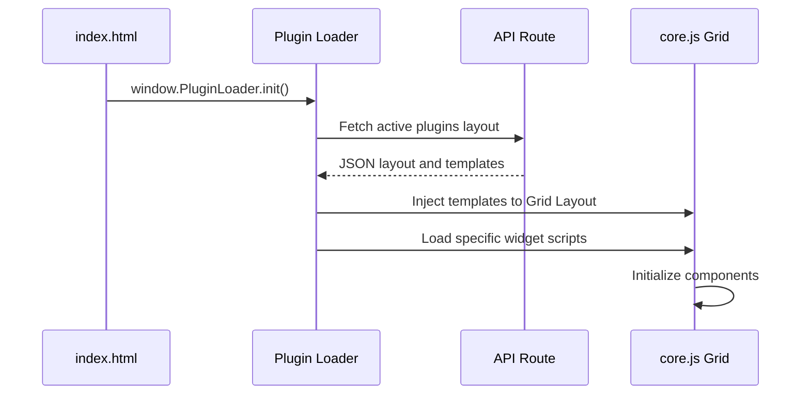
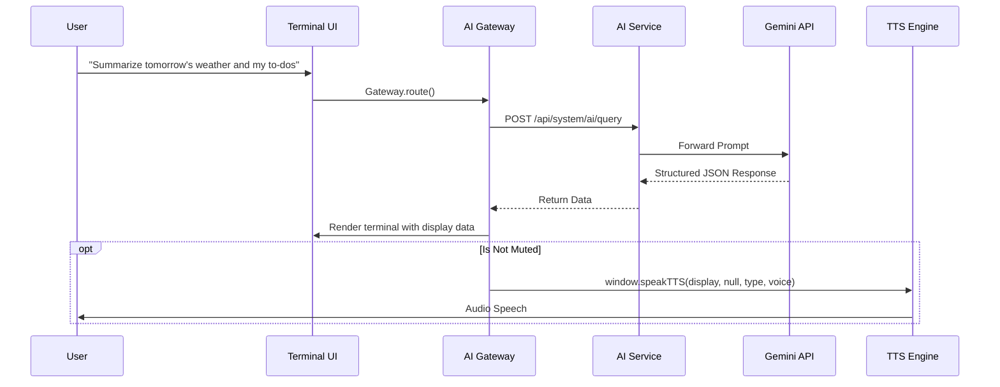

# AEGIS System Architecture

This document provides a comprehensive reference for the AEGIS Dashboard system's architecture, data flow, design patterns, Routine Manager internals, and environment variable structure. It serves as an essential onboarding reference for new developers and AI instances, and acts as a guardrail against inconsistent code modifications.

---

## 1. System Overview

AEGIS is a modular AI dashboard system built on a proprietary **"Plugin-X"** architecture. A Python Flask backend and a Vanilla JS frontend communicate through a REST API layer.

### 1.1 High-Level Architecture

---

## 2. Design Patterns & Philosophy

AEGIS strictly follows the principles of **Modularity** and **Separation of Concerns**.

1. **Plugin-X Architecture:**
   * Keep the core lightweight; all extended functionality (weather, calendar, wallpaper, etc.) is isolated into independent folders under `plugins/`.
   * Each plugin is **self-contained**, with its own router (`router.py`), frontend assets (`widget.js`, `widget.css`), and configuration.
2. **Frontend-Backend Decoupling:**
   * Server-side HTML rendering (via Jinja, etc.) is avoided (except for the initial container injection). All data exchange uses JSON-based REST APIs.
3. **Event-Driven Communication:**
   * Widgets never reference each other directly. They communicate through global objects (`window.reactionEngine`, `window.speakTTS`) or custom events, maintaining loose coupling.
4. **Schema-Driven AI:**
   * Instead of free-form LLM calls, AEGIS enforces a JSON schema (`response_schema` — typically `display`, `voice`, `sentiment` structure) to manage response quality and eliminate parsing errors at the source.

---

## 3. Environment Variables & Configuration

AEGIS uses a sophisticated configuration file system to prevent source code hardcoding.

* **`config/secrets.json` (Security Keys):**
  * Stores all external API keys: `NOTION_TOKEN`, `WEATHER_API_KEY`, `GOOGLE_OAUTH_CLIENT_SECRET`, `GEMINI_API_KEY`, etc. (Must not be committed to Git)
* **`config/api.json` (System Behavior):**
  * Manages system initialization info: host, port, auth mode (Local/Google), active plugin list.
* **`config/settings.json` (User Preferences):**
  * Persistently stores runtime-changeable browser settings such as UI theme, language (`lang`), and fonts.
* **OS Compatibility (Windows/Linux/Render.com):**
  * All path operations use `os.path.join` for Linux-based production deployment (Render.com). Security keys can be injected directly from the production server's environment variables.

---

## 4. Routine Manager & Scheduler

The core engine that enables AEGIS to act **proactively** without user intervention. The frontend's `briefing_scheduler.js` and the backend's `plugins/scheduler` cooperate to function.

1. **Polling Loop Mechanism:**
   * The frontend routine manager (`briefing_scheduler.js`) uses `setInterval` to periodically check the current time (1-minute/1-second intervals).
2. **Schedule & Condition Matching:**
   * Compares the current time against pre-configured routines stored as JSON (e.g., "Summarize weather at 8 AM", "Quote summary every hour").
3. **Automated Execution (Routine Execution):**
   * When a trigger timing matches, the routine manager invokes the Briefing Manager or AI Gateway in the background.
   * The backend aggregates data from registered plugins (e.g., Weather, Notion) and calls the `AI Service` to generate summary content.
4. **Automatic Sound & Motion Mapping:**
   * The AI-generated summary (`briefing`) text and sentiment state are immediately passed to `tts.js` for voice output, while the motion engine automatically triggers the appropriate avatar emotion.

---

## 5. Core Modules & Managers

### 5.1 AI Gateway (`ai_gateway.js` / Backend `ai_service.py`)
* **Role:** Terminal command routing and LLM query control gateway.
* **Local Command Parsing:** Detects flags (`--mute`) and aliases via regex.
* **Response Distribution:** Cleanly separates `display` (UI renderer) and `briefing/voice` (TTS engine) data paths.

### 5.2 TTS Engine (`tts.js`)
* **Role:** The system's sole **Single Point of Truth for Audio** output.
* **Specification:** `window.speakTTS(text, audioUrl, visualType, speechText)`
  * External managers must never create their own audio objects. They must always inject `speechText` (pure text with markdown stripped) into the above function to avoid bugs.

### 5.3 External API Manager (`external_api_manager.js`)
* **Role:** Receives action events (commands/motions/speech) force-injected via HTTP from external script-based chatbots (e.g., OpenClaw) or external systems, and dispatches them to the internal network. Uses a polling-based queue.

### 5.4 Messaging Hub (`BotManager` / `bot_gateway.py`) [v3.4.0]
* **Role:** The central cognitive logic hub that manages messaging input/output from all platforms, including Web Terminal, Discord, and Telegram.
* **Unified Command System:** Interprets the `/@` (Hybrid), `/` (Local), and `/#` (Search) command symbols consistently across all platforms.
* **Loose Coupling Adapters:** Provides a `BotAdapter` abstract interface that allows adding new platforms (like Discord) without modifying the core system.
* **Automatic Multi-language Switching:** Supplies localized system instructions to the AI via `utils.get_i18n()` based on the user's language environment.

---

## 6. Core Widgets & Plugins

Each AEGIS feature is isolated and managed in its own folder while maintaining full independence.

* **Terminal Widget (`terminal`):** The main command hub where users send queries to the system. Controls the system across both frontend and backend.
  * **HUD-Style Design:** Not a regular widget — it drops from the top of the screen (Quake-style) and is globally callable via shortcut (`Shift + ~` or `` ` ``). Press `Escape` to close.
  * **How It Works:**
    1. When the user finishes input and presses `Enter`, it passes through `TerminalUI.appendLog` to `window.CommandRouter.route(cmd, model)`.
    2. Locally parseable commands (e.g., `/help`, `/term`) are handled immediately on the frontend; all others pass through `ai_gateway.js` to the backend (`POST /api/system/ai/query`).
  * **Plugin Command Registration:**
    * Plugins can dynamically register unlimited custom commands via `context.registerCommand(cmd, callback)`.
    * **Example (Terminal settings):**
      `/term height 70` → Dynamically adjusts terminal height to 70vh.
      `/term lines 300` → Increases log line limit to 300.
  * **Key Integration Parameters & Global Functions:**
    * `window.appendLog(source, message, isDebug)`: Global API for broadcasting system messages or error logs to the screen. Accessible by all modules.
    * `modelSelector`: Switches between AI engines (Gemini, Ollama/Llama3, etc.) on-the-fly. Assigned to `window.AEGIS_AI_MODEL` on the frontend and passed to the backend during routing.
* **System Profile / Title Widget (`system-stats`):** Displays dynamic info such as system IP, CPU/RAM usage, and user welcome messages.
* **Wallpaper Widget (`wallpaper`):** Renders photos/videos on the background canvas and provides a management API set.
* **Notion Task & Calendar (`notion-task`):** Real-time schedule and Kanban board card loading via Notion API (periodic data reload pattern).
* **AI Studio (`studio`):** A control center connecting the browser to PC-local VTS (Vtube Studio), managing avatar models and emotion/reaction scripts.
* **Alarm Plugin (`alarm`):** An intelligent alarm system integrated with the user's routine. AI can set alarms directly (`[ACTION] SET_ALARM`), or users can manage them via the dashboard widget. All data is precisely synchronized via a standard API.

---

## 7. Component Interaction Sequences

### Case 1: Dashboard Initialization & Widget Mounting

### Case 2: Complex AI Query Processing Flow

Shows how commands, APIs, and TTS interweave. Notably, the backend focuses on formatting while UI control is entirely the frontend's responsibility.

---

## 8. System Design Principles (Development Commandments)

When modifying code within AEGIS, the following design conventions must be **strictly** observed.

1. **No Plugin-X Encapsulation Violations:**
   * Do not hardcode specific features (e.g., a calendar query function) into core files (`app_factory.py`, `gods.py`) except for globally shared utility libraries. New features must always be built inside a `plugins/new_feature/` folder.
2. **Enforce Schema-Driven Communication:**
   * When processing data with LLMs, do not allow the AI to respond with free-form text. When calling `generate_content`, always use the `response_schema` parameter to enforce JSON format with `display` and `voice` keys.
3. **(Warning) Gemini Search Tools Conflict:**
   * When requesting structured JSON output from Gemini 2.0+, having the `Search` property enabled causes a 400 error. Always force-declare `tools=[]` in the API call configuration to prevent this.
4. **OS Compatibility Defense:**
   * Write code that is not limited to the development environment (Windows). Never hardcode absolute paths like `C:\`. Always use `os.path.join(BASE_DIR, ...)` to prevent path breakage during Linux (Render.com) deployment.
5. **No Direct DOM Injection on Output:**
   * XSS-prone code that directly inserts AI responses into `Element.innerHTML` is prohibited. Use the provided `marked.js` module or component data binding patterns instead.
