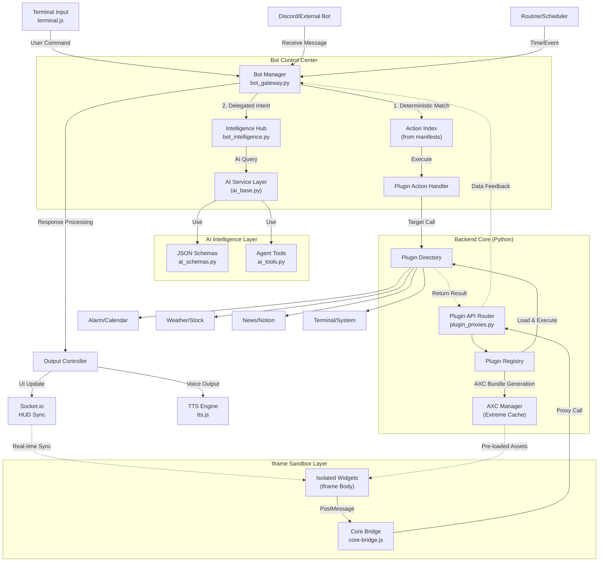

# AEGIS System Architecture (v4.0.0)

This document defines the comprehensive architecture, data flow, design pattern philosophy, Routine Manager operational principles, and environment variable structure of the AEGIS dashboard system. It includes the latest technical specifications introduced from v4.0.0, such as **Iframe Isolation**, **AXC**, and **Parallel Hydration**, and serves as a mandatory reference for maintaining system consistency and security.

---

## 1. System Overview

AEGIS is a modular AI dashboard system designed based on its unique **"Plugin-X"** architecture and the **"Determinism First"** principle. From v4.0, it has secured both user experience and security simultaneously through stronger **physical isolation (Iframe Isolation)** and **ultra-fast loading (AXC)**.

### 1.1 High-Level Architecture (v4.0.0)

The core of the v4.0 architecture is the **Iframe-based sandbox** and **Parallel Hydration via AXC**.

---

## 2. Design Pattern & Philosophy

AEGIS v4.0 follows strict principles of **Isolation** and **Deterministic Control**.

### 2-1. Plugin-X v4.0 Architecture
- **Iframe Physical Isolation**: Every widget runs within an independent Iframe. This physically resolves the limitations of legacy Shadow DOM (Global CSS variable pollution, JS global object collisions, etc.).
- **Capability Proxy (Context API)**: Widgets cannot directly access system resources and communicate only through the injected `context` object.

### 2-2. AXC (AEGIS Extreme Cache)
- **Extreme Speed**: All plugin assets (HTML/JS/CSS) are bundled into a single SHA256 hash-based bundle and cached in the client's IndexedDB.
- **Zero Latency**: All widgets load within 10ms, regardless of network status.

### 2-3. Parallel Hydration
- **Async Injection**: The layout (Grid) of the main UI is created first, and then assets are injected into each Iframe in parallel. This prevents UI blocking during loading.

### 2-4. Determinism First
- To prevent AI hallucinations, clear user intentions (Commands) are immediately routed to deterministic action handlers defined in `manifest.json`.

### 2-5. Event Delegation Standard
- For performance and stability, inline events are not assigned to individual DOM elements; instead, events are managed collectively at the `root` element based on `data-action`.

---

## 3. Environment Variables & Configuration

AEGIS operates a sophisticated configuration file system to prevent hard-coding in source code and fully supports cloud deployments (Render.com, etc.).

*   **`config/secrets.json` (Security Key Management):**
    *   Holds all external API integration keys such as `NOTION_TOKEN`, `WEATHER_API_KEY`, `GOOGLE_OAUTH_CLIENT_SECRET`, and `GEMINI_API_KEY`.
*   **`config/api.json` (System Operation Settings):**
    *   Manages system initialization information (Host, Port, Authentication mode).
*   **`config/settings.json` (User Settings):**
    *   Saves runtime settings such as UI theme, language (`lang`), and fonts.
*   **Environment Compatibility (OS Protection):**
    *   `os.path.join` is mandatory for path compatibility between Windows and Linux (Render), and secret key injection via environment variables (`os.environ`) is supported.

---

## 4. Routine Manager & Scheduler

The core heart that enables AEGIS to operate proactively.

1.  **Polling Loop Mechanism:**
    *   Frontend's `briefing_scheduler.js` periodically compares the current time with registered routines.
2.  **Schedule and Condition Comparison:**
    *   Checks routine conditions (Time, sensor data, etc.) delivered from the backend (`plugins/scheduler`).
3.  **Routine Execution:**
    *   When a trigger occurs, calls the `Briefing Manager` to collect data (Context) from each plugin and generates summary content via AI.
4.  **Automatic Sound and Motion Mapping:**
    *   Results are immediately delivered to `tts.js` and the Studio reaction engine to perform speech and avatar motions.

---

## 5. Core Modules & Managers

### 5.1 Bot Messaging Hub (`bot_gateway.py` & `bot_intelligence.py`)
*   **BotManager:** In charge of message reception, permission verification, and command routing.
*   **IntelligenceHub:** AI cognitive layer. Dedicated to NLP fallback and action tag parsing.
*   **3-Tier Command System:**
    1.  **Systematic (/)**: Deterministic execution (Manifest Actions).
    2.  **Hybrid (/@)**: Combination of Context + AI.
    3.  **Pure AI (/#)**: Pure AI knowledge-based processing.

### 5.2 AI Intelligence Layer (`gemini_service.py`)
*   **GeminiClientWrapper**: Communication wrapper for Google Gemini API.
*   **Centralized Schemas (`ai_schemas.py`):** Centrally manages JSON specifications for all AI responses to prevent parsing errors.
*   **Agent Tools (`ai_tools.py`):** Modularized set of functions executable by AI.

### 5.3 Plugin Registry & Security
*   **Registry**: Manages the plugin's `Context Provider` and `Action Handler`.
*   **Security Service**: Checks at runtime whether the plugin complies with allowed API levels and paths.

### 5.4 Hybrid Render & Sandbox
*   **HybridRenderer**: Decides between Iframe isolation or direct system injection (Level 1) based on the widget's `hybrid_level`.
*   **Sandbox Bridge**: PostMessage API wrapper for secure communication between the inside and outside of the Iframe.

---

## 6. Hybrid Levels & Plugin-X Standards

AEGIS v4.0 supports three levels of isolation depending on the importance and functionality of each widget.

| Level | Designation | Description |
|---|---|---|
| **Level 1** | System Internal | Runs at the same DOM level as the dashboard core (System UI such as wallpaper, sidebar, etc.) |
| **Level 2** | Standard Iframe | **[v4.0 Standard]** Runs within a completely isolated Iframe. Applied to most third-party plugins |
| **Level 3** | Hybrid Advanced | Maintains Iframe isolation while securing direct channels to specific system resources |

---

## 7. System Design Principles

1. **Strict Encapsulation**: All features must be built independently under `plugins/`, and modification of `app_factory.py` is prohibited.
2. **Schema-Driven Coding**: AI response processing must follow the format in `ai_schemas.py`.
3. **OS Environment Compatibility**: All path processing is written considering cross-platform compatibility.
4. **No Direct DOM Injection on Output**: To prevent XSS, AI response text must go through a verified renderer (`marked.js`, etc.).
5. **Event Stop Propagation**: All interactive elements within Iframe widgets must call `e.stopPropagation()` to prevent interference with widget drag events.

---
**AEGIS Architecture v4.0.0 Global Standard**
**This document fully reflects the v4.0 architecture overhaul and is an official document that has refined legacy terminology.**
