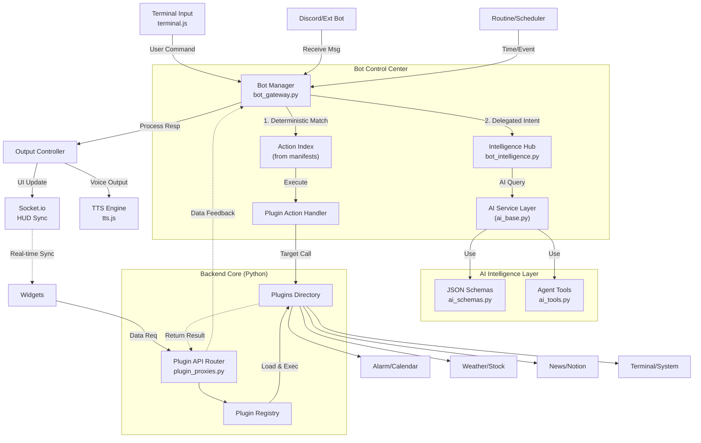
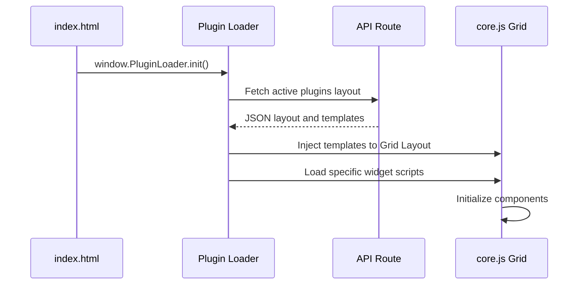
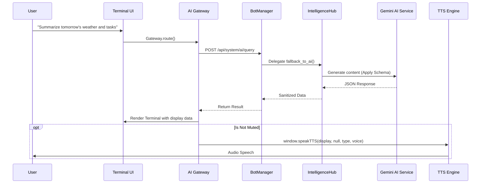

# AEGIS System Architecture

This document provides a comprehensive definition of the AEGIS dashboard system's architecture, data flow, design philosophies, routine management, and environment variable structure. it serves as a vital reference for understanding the system and prevents inconsistent code modifications.

---

## 1. System Overview (System Overview)

AEGIS is a modular AI dashboard system built on the proprietary **"Plugin-X"** architecture and the **"Determinism First"** principle. It features a Python Flask-based backend and a Vanilla JS-based frontend that communicate in real-time via REST APIs and WebSocket (Socket.io) layers.

### 1.1 High-Level Architecture (v3.7.0)

---

## 2. Design Pattern & Philosophy (Design Pattern & Philosophy)

AEGIS adheres strictly to the principles of **Modularity** and **Deterministic Control**.

1.  **Plugin-X Architecture:**
    *   Isolates all extensions into independent folders (`plugins/`). Each plugin defines its metadata, permissions, and **Fixed Actions** via `manifest.json`.
2.  **Determinism First (v3.7.0):**
    *   To prevent AI hallucinations, commands with clear user intent (e.g., `/play`, `/alarm`) are routed immediately to registered handlers without AI intervention.
3.  **Tiered Messaging Hub:**
    *   All inputs converge at `BotManager`, but processing is layered. `BotManager` focuses on routing (delivery), while complex cognition is handled by `IntelligenceHub`, and low-level AI communication is managed by `ai_base`.
4.  **Event-Driven Sync:**
    *   State changes trigger the `sync_cmd` protocol to synchronize the screens of all connected clients (Web UI, Desktop HUD) via WebSocket.
5.  **Schema-Driven AI & Centralized Registry:**
    *   `ai_schemas.py` centrally manages all AI response schemas to eliminate parsing errors and maintain system consistency.

---

## 3. Environment Variables & Configuration (Environment Variables & Configuration)

AEGIS operates a sophisticated configuration system to avoid hardcoding.

*   **`config/secrets.json` (Secret Key Management):**
    *   Stores all external API keys (`NOTION_TOKEN`, `WEATHER_API_KEY`, `GOOGLE_OAUTH_CLIENT_SECRET`, `GEMINI_API_KEY`, etc.). (Must not be uploaded to Git)
*   **`config/api.json` (System Operation Settings):**
    *   Manages initialization info (Host, Port, Auth mode (Local/Google), Active plugins list).
*   **`config/settings.json` (User Settings):**
    *   Persists runtime browser settings like UI themes, language (`lang`), and fonts.
*   **OS Compatibility (OS/Render.com):**
    *   All paths use `os.path.join` for compatibility with Linux-based production platforms (Render). Security keys can be injected directly from environmental variables on the production server.

---

## 4. Routine Manager & Scheduler (Routine Manager Principles)

The core proactive "heart" of AEGIS, where `briefing_scheduler.js` (Frontend) and `plugins/scheduler` (Backend) cooperate.

1.  **Polling Loop Mechanism:**
    *   The frontend routine manager uses `setInterval` to check the current time periodically (e.g., every minute/second).
2.  **Schedule & Condition Comparison:**
    *   Compares the current time with backend routines (JSON config - e.g., "Weather summary at 8 AM").
3.  **Routine Execution:**
    *   Triggers briefings or AI gateway calls in the background when the timing matches.
    *   The backend aggregates data from active plugins (Weather, Notion, etc.) and calls the `AI Service` to generate summary content.
4.  **Auto Sound & Motion Mapping:**
    *   AI-generated `briefing` text and emotions are sent to `tts.js` for speech and trigger matching avatar emotions via the motion engine.

---

## 5. Core Modules & Managers (Core Modules)

### 5.1 Bot Messaging Hub (`bot_gateway.py` & `bot_intelligence.py`) [v3.7.0]
*   **BotManager**: Oversight of message reception, permission validation, adapter management, and command routing.
*   **IntelligenceHub**: AI cognition layer. Handles prompt generation, action tag parsing, and NLP fallback.
*   **BotAdapter**: Abstract interface for platform independence (`bot_adapters.py`).
*   **Command Priority:**
    1.  **System Command**: `/help`, `/term`, etc. (Core system control).
    2.  **Deterministic Action**: Fixed mappings via `manifest.json`.
    3.  **Hybrid Context (@)**: AI conversation with targeted plugin context.
    4.  **External Search (#)**: Forced Google search.
    5.  **AI Fallback**: General conversation.

### 5.2 AI Intelligence Layer (`gemini_service.py`) [v3.7.0]
*   **GeminiClientWrapper (`ai_base.py`)**: AI client config and base communication.
*   **Centralized Schemas (`ai_schemas.py`)**: Registry for briefing and command response schemas.
*   **Agent Tools (`ai_tools.py`)**: Modular set of executable agent functions (Search, System Data).

### 5.3 Plugin Registry (`services/plugin_registry.py`)
*   Acts as a global registry and data broker. Manages `Context Providers`, `Action Handlers`, and the `Deterministic Index` centrally.

### 5.4 TTS Engine (`tts.js`)
*   Single endpoint for system audio output. Processes AI `briefing` responses.
*   Specification: `window.speakTTS(text, audioUrl, visualType, speechText)`. External managers must not create audio objects; they must use `speechText` (sanitized text) to avoid bugs.

---

## 6. Core Widgets & Plugins (Major Widgets)

*   **Plugin-X Standard**: Plugins follow the structure: `manifest.json`, `router.py`, `service.py`, `index.js`, `style.css`.
*   **Action Registration**: `initialize_plugin()` registers functions as system commands at load time via `register_plugin_action`.
*   **Terminal Widget (`terminal`)**: The main command hub for user queries, supporting HUD-style Quake interface and keyboard shortcuts (`Shift + ~`).
    *   **HUD Design**: Not a normal widget; it's a fullscreen-style overlay called with a shortcut (`Escape` to close).
    *   **Operating Principle**: 
        1.  Input is passed to `window.CommandRouter.route()`.
        2.  Local commands (`/help`, `/term`) are processed in the frontend; others are sent to the backend (`POST /api/system/ai/query`).
    *   **Dynamic Command Registration**:
        *   Infinite commands can be registered via `context.registerCommand()`.
        *   **Example**: `/term height 70` (Adjusts terminal height dynamically).
    *   **Global Integration**:
        *   `window.appendLog()`: Shared API to display system messages or errors.
        *   `modelSelector`: Hot-swaps processing engines (Gemini, Ollama).

---

## 7. Component Interaction Sequence (Component Interaction)

### Case 1: Dashboard Initialization & Widget Mount

### Case 2: Complex AI Query Processing (v3.7.0 Modularized)

Shows how commands, APIs, and TTS are linked. The backend focuses on formatting while the frontend handles UI control.

---

## 8. System Design Principles (Compliance Required)

AI instances must **strictly** follow these conventions when modifying code in AEGIS:

1.  **No Plugin-X Encapsulation Violations**:
    *   Never hardcode specific features into core files (`app_factory.py`, `gods.py`). New features must reside within `plugins/new_feature/`.
2.  **Mandatory Schema-Driven Communication & Centralization**:
    *   Never let the AI respond with raw text. Always use schemas defined in `ai_schemas.py` to receive JSON.
3.  **Avoid Gemini Search Tools Conflicts**:
    *   Force `tools=[]` when requesting structured output to avoid 400 errors from search tool conflicts in Gemini 2.0+.
4.  **OS Environment Resilience**:
    *   Never hardcode absolute paths like `C:\`. Use `os.path.join(BASE_DIR, ...)` for compatibility with Linux (Render.com).
5.  **No Direct DOM Injection on Output**:
    *   XSS prevention. Never use `innerHTML` directly with AI responses; use `marked.js` or data binding.
